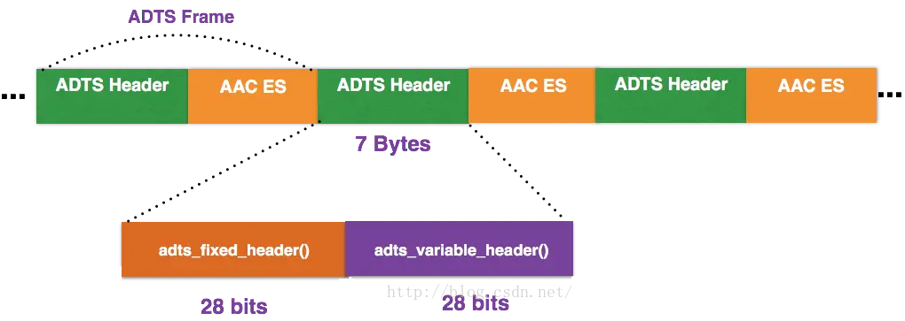
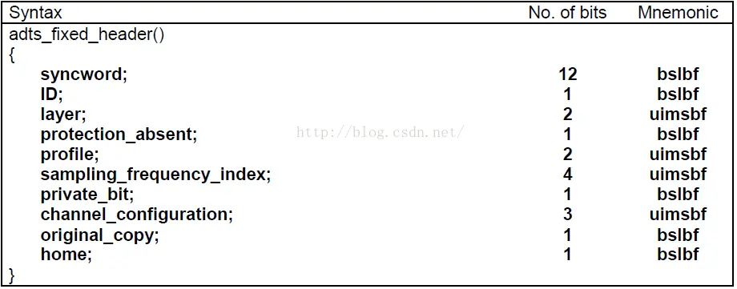
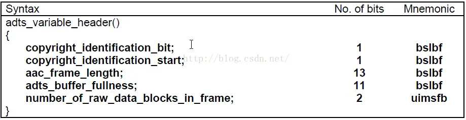
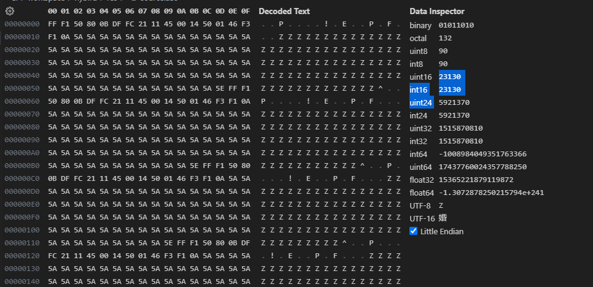

# 流媒体协议之AAC协议

Advanced Audio Coding(高级音频解码)，是⼀种由MPEG-4标准定义的有损⾳频压缩格式。

AAC协议格式分为ADIF格式和ADTS格式。本文主要分析ADTS格式。

## ADIF

Audio Data Interchange Format 音频数据交换格式。这种格式的特征是可以确定的找到这个音频数据的开始，不能在音频数据流中间开始的解码，即它的解码必须在明确定义的开始处进⾏。故这种格式常⽤在磁盘⽂件中。

## ADTS

Audio Data Transport Stream。是AAC音频的传输流格式，AAC音频格式在MPEG-2（ISO-13318-7 2003）中有定义。AAC后来又被采用到MPEG-4标准中。这种格式的特征是它是⼀个有同步字的比特流，解码可以在这个流中任何位置开始，它的特征类似于mp3数据流格式。

ADTS可以在`任意帧解码`，也就是说它`每⼀帧都有头信息`。ADIF只有⼀个统⼀的头，所以必须得到所有的数据后解码。

一般情况下**ADTS**的头信息都是**7**个字节，分为 2 部分：

- adts_fixed_header
- adts_variable_header

但也有为9字节情况。 protection_absent=0 时，header length=9bytes；protection_absent=1 时，header length=7bytes；即是否有CRC校验码。

### adts_fixed_header

### adts_variable_header

- **syncword**：同步头，总是**0xFFF**，**all bits must be 1**，代表着一个**ADTS**帧的开始。
- **ID**：**MPEG**标识符，**0**标识**MPEG-4**，**1**标识**MPEG-2**。
- **Layer**：always: **'00'**。
- **protection_absent**：表示是否误码校验。**Warning, set to 1 if there is no CRC and 0 if there is CRC**。
- **profile**：表示使用哪个级别的**AAC**，如**01 Low Complexity(LC)--- AAC LC**。有些芯片只支持**AAC LC**。**profile**的值等于**Audio Object Type 的值减 1**。**profile = MPEG-4 Audio Object Type - 1**。
- **sampling_frequency_index**：表示使用的采样率下标，通过这个下标在**Sampling Frequencies[]数组**中查找得知采样率的值。
- **channel_configuration**：表示声道数，比如 2 表示立体声双声道。
- **frame_length**：一个**ADTS**帧的长度包括**ADTS 头和 AAC 原始流**：
  - frame length, this value must include 7 or 9 bytes of header length；
  - aac_frame_length = (protection_absent == 1 ? 7 : 9) + size(AACFrame)；
  - protection_absent=0 时，header length=9bytes；
  - protection_absent=1 时，header length=7bytes；
- **adts_buffer_fullness**：**0x7FF**说明是**码率可变**的码流。
- **number_of_raw_data_blocks_in_frame**：表示**ADTS**帧中有**number_of_raw_data_blocks_in_frame + 1**个**AAC**原始帧。所以说**number_of_raw_data_blocks_in_frame == 0**表示说**ADTS**帧中只有一个**AAC**数据块。

使用命令`ffmpeg -i source.flv -vn -acodec copy source.aac`可以分离出aac音频

如下：

