# 流媒体之FLV文件

[TOC]

## FLV概述

* FLV（Flash Video）是Adobe公司推出的一种媒体封装格式。一个FLV文件，每个Tag类型都属于一个

流。也就是说一个FLV文件最多只有一路音频流、一个路视频流，不能定义单个类型的多个独立流在一个

文件中。

*  FLV数据以大端序存储，解析时需要注意。比如：0x12C，那么存储时就是0x01 0x2C。FLV封装格式

由一个FLV Header和FLV Body组成，其中FLV Body由很多个Tag组成。**Tag一般可以分为三种类型：**脚本

数据类型、音频数据类型、视频数据类型。

* 一个标准的FLV文件结构如下图所示：

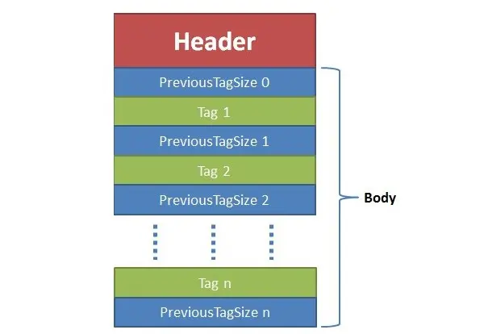

* 其中flv header为9字节
* previousTagsize0总为0

## FLV header

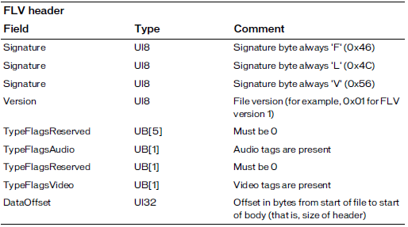

以上为官方的字段解释，以下为解释

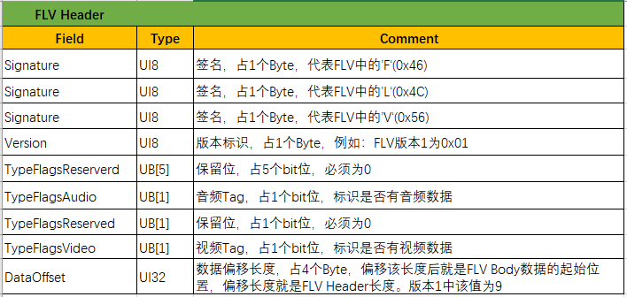

是否有音频`data[4] & 0x04`, 是否有视频`data[4] & 0x01`

## FLV Body

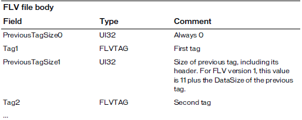

以上为官方解释，其中注意，PreviousTagSize0一直为0。

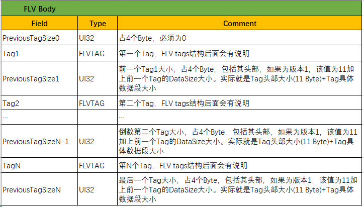

每一个tag其实是由两部分组成，Tag header(11 Byte)+Tag data(实际数据域)。Tag Header中存放着

TagType、DataSize等字段信息。而Tag data部分就是实际数据域信息，后面会分别讲述数据域(Tag data)。

### FLV Tag

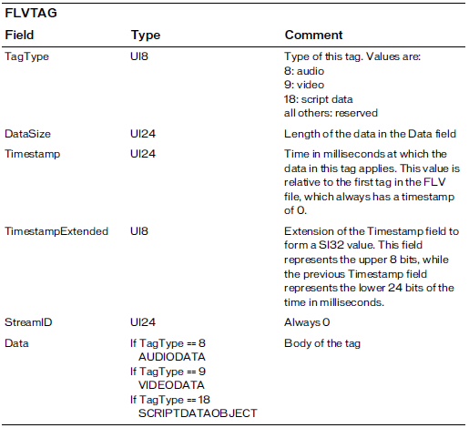

以上为官方解释

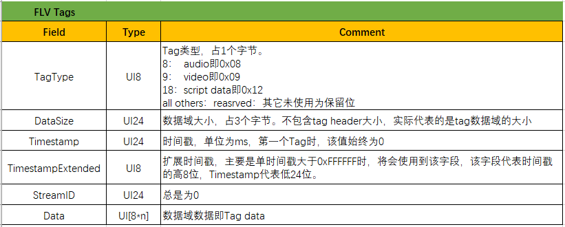

### FLV Data

* #### audio data tag

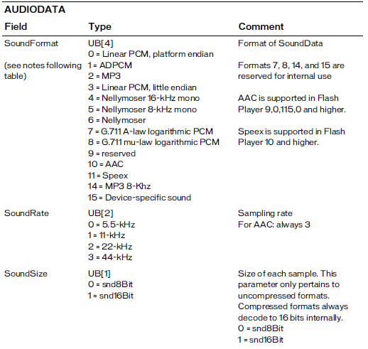

以上为官方解释


其中 AACAUDIODATA为

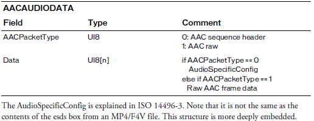

* #### video data tag

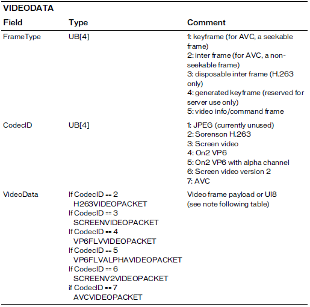

以上为官方解释

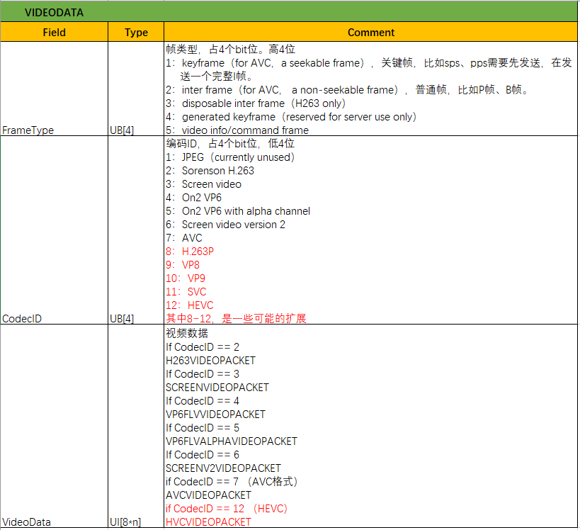

其中AVCVIDEOPACKET为

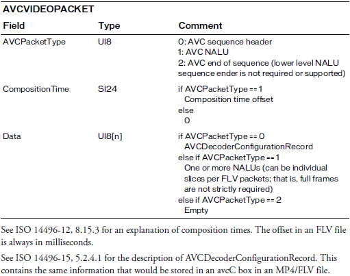

* #### script data tag

amf格式。 // todo 进行补充

## ffmpeg的flv源码解析

文件位于`libavformat/flvenc.c`

主要为以下三个函数

```
    .write_header   = flv_write_header,
    .write_packet   = flv_write_packet,
    .write_trailer  = flv_write_trailer,
```

下面分析

```
static int flv_write_header(AVFormatContext *s)
{
    int i;
    AVIOContext *pb = s->pb;
    FLVContext *flv = s->priv_data;

    avio_write(pb, "FLV", 3);
    avio_w8(pb, 1);
    avio_w8(pb, FLV_HEADER_FLAG_HASAUDIO * !!flv->audio_par +
                FLV_HEADER_FLAG_HASVIDEO * !!flv->video_par); // 是否有音频或者视频
    avio_wb32(pb, 9); // 到此头部九个字节全部写入
    avio_wb32(pb, 0); // 到这是第一个PreviousTagSize0


    for (i = 0; i < s->nb_streams; i++)
        if (s->streams[i]->codecpar->codec_tag == 5) { // 这个5待分析
            avio_w8(pb, 8);     // message type
            avio_wb24(pb, 0);   // include flags
            avio_wb24(pb, 0);   // time stamp
            avio_wb32(pb, 0);   // reserved
            avio_wb32(pb, 11);  // size
            flv->reserved = 5;
        }

    if (flv->flags & FLV_NO_METADATA) {
        pb->seekable = 0;
    } else {
        write_metadata(s, 0); // 元数据写入 数据类型为18
    }

    for (i = 0; i < s->nb_streams; i++) {
        flv_write_codec_header(s, s->streams[i]->codecpar, 0); // codec头部
    }

    flv->datastart_offset = avio_tell(pb);
    return 0;
}
```

