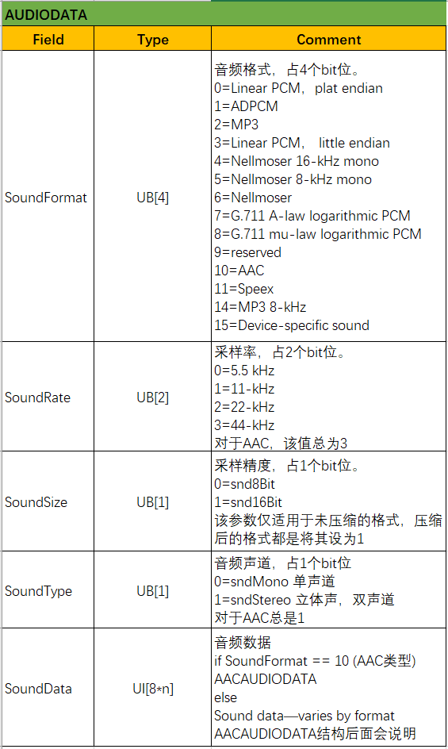
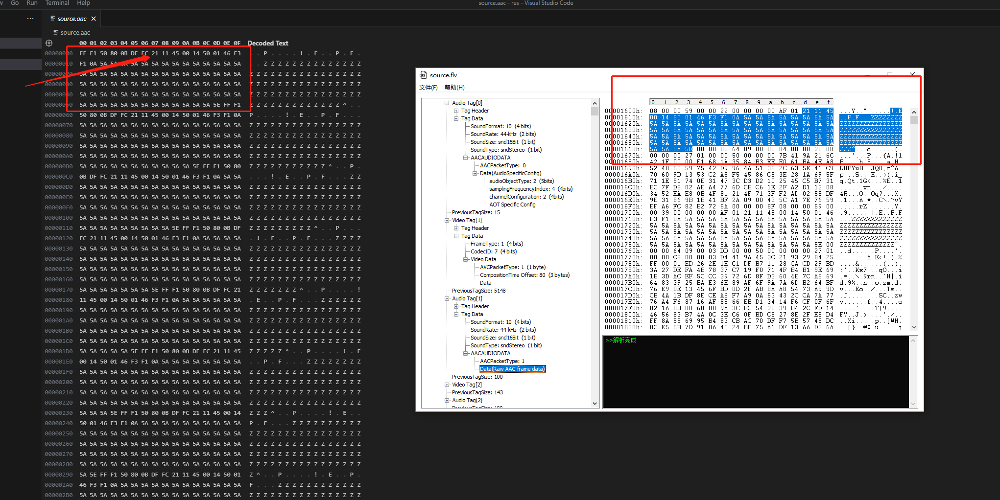

# 流媒体之FLV文件

[TOC]

## FLV概述

* FLV（Flash Video）是Adobe公司推出的一种媒体封装格式。一个FLV文件，每个Tag类型都属于一个

流。也就是说一个FLV文件最多只有一路音频流、一个路视频流，不能定义单个类型的多个独立流在一个

文件中。

*  FLV数据以大端序存储，解析时需要注意。比如：0x12C，那么存储时就是0x01 0x2C。FLV封装格式

由一个FLV Header和FLV Body组成，其中FLV Body由很多个Tag组成。**Tag一般可以分为三种类型：**脚本

数据类型、音频数据类型、视频数据类型。

* 一个标准的FLV文件结构如下图所示：


* 其中flv header为9字节
* previousTagsize0总为0

如下图：


## FLV header


以上为官方的字段解释，以下为解释


是否有音频`data[4] & 0x04`, 是否有视频`data[4] & 0x01`

如下图：


## FLV Body


以上为官方解释，其中注意，PreviousTagSize0一直为0。


每一个tag其实是由两部分组成，Tag header(11 Byte)+Tag data(实际数据域)。Tag Header中存放着

TagType、DataSize等字段信息。而Tag data部分就是实际数据域信息，后面会分别讲述数据域(Tag data)。

### FLV Tag


以上为官方解释


如下：


### FLV Data

* #### audio data tag


以上为官方解释



其中 AACAUDIODATA为


如下：


其中AACPacketType为0时是AudioSpecificConfig，为1时是AACFrameData

```
该段伪码即为AudioSpecificConfig的解析代码
5 bits: object type
if (object type == 31)
    6 bits + 32: object type
4 bits: frequency index
if (frequency index == 15)
    24 bits: frequency
4 bits: channel configuration
var bits: AOT Specific Config
```

使用命令`ffmpeg -i source.flv -vn -acodec copy source.aac`即可获得aac的音频流



* #### video data tag


以上为官方解释


其中AVCVIDEOPACKET为


如下：


由上可知，为0时为AVCSequenceHeader，为1时为AVC NALU，为2时为低版本协议

AVCSequenceHeader如下图，数据可看`01 64 00 20 xxxx`上图


AVC NALU如下，可使用命令`ffmpeg -i source.flv -c:v copy source.h264`

开头有四字节`00 00 02 B0`十进制为688，在左侧h264中，可见在0x2B0处出现了开始头`00 00 00 01`, 后续数据接的是sps和pps两个数据+后续数据`65 88 84 00 21 FF 42 43` 在FLV文件0x4A0处


* #### script data tag

amf格式。 其中格式详情见amf格式。


其中SCRIPTDATAOBJECTEND和SCRIPTDATAVARIABLEEND为0x000009，用于标记结尾，可见下图有`00 00 09`结尾符


## ffmpeg的flv源码解析

文件位于`libavformat/flvenc.c`，看源码时建议搭配上面协议一起看

主要为以下三个函数

```
    .write_header   = flv_write_header,
    .write_packet   = flv_write_packet,
    .write_trailer  = flv_write_trailer,
```

下面分析flv_write_header

```
static int flv_write_header(AVFormatContext *s)
{
    int i;
    AVIOContext *pb = s->pb;
    FLVContext *flv = s->priv_data;

    avio_write(pb, "FLV", 3);
    avio_w8(pb, 1);
    avio_w8(pb, FLV_HEADER_FLAG_HASAUDIO * !!flv->audio_par +
                FLV_HEADER_FLAG_HASVIDEO * !!flv->video_par); // 是否有音频或者视频
    avio_wb32(pb, 9); // 到此头部九个字节全部写入
    avio_wb32(pb, 0); // 到这是第一个PreviousTagSize0


    for (i = 0; i < s->nb_streams; i++)
        if (s->streams[i]->codecpar->codec_tag == 5) { // 这个5待分析
            avio_w8(pb, 8);     // message type
            avio_wb24(pb, 0);   // include flags
            avio_wb24(pb, 0);   // time stamp
            avio_wb32(pb, 0);   // reserved
            avio_wb32(pb, 11);  // size
            flv->reserved = 5;
        }

    if (flv->flags & FLV_NO_METADATA) {
        pb->seekable = 0;
    } else {
        write_metadata(s, 0); // 元数据写入 数据类型为18
    }

    for (i = 0; i < s->nb_streams; i++) {
        flv_write_codec_header(s, s->streams[i]->codecpar, 0); // codec头部
    }

    flv->datastart_offset = avio_tell(pb);
    return 0;
}

static void write_metadata(AVFormatContext *s, unsigned int ts) // 对应的是scriptData
{
    AVIOContext *pb = s->pb;
    FLVContext *flv = s->priv_data;
    int write_duration_filesize = !(flv->flags & FLV_NO_DURATION_FILESIZE);
    int metadata_count = 0;
    int64_t metadata_count_pos;
    const AVDictionaryEntry *tag = NULL;

    /* write meta_tag */
    avio_w8(pb, FLV_TAG_TYPE_META);            // tag type META
    flv->metadata_size_pos = avio_tell(pb);
    avio_wb24(pb, 0);           // size of data part (sum of all parts below)
    put_timestamp(pb, ts);      // timestamp
    avio_wb24(pb, 0);           // reserved

    /* now data of data_size size */

    /* first event name as a string */
    avio_w8(pb, AMF_DATA_TYPE_STRING);
    put_amf_string(pb, "onMetaData"); // 12 bytes

    /* mixed array (hash) with size and string/type/data tuples */
    avio_w8(pb, AMF_DATA_TYPE_MIXEDARRAY);
    metadata_count_pos = avio_tell(pb);
    metadata_count = 4 * !!flv->video_par +
                     5 * !!flv->audio_par +
                     1 * !!flv->data_par;
    if (write_duration_filesize) {
        metadata_count += 2; // +2 for duration and file size
    }
    avio_wb32(pb, metadata_count);

    ... // 一些数据写入
}

static void flv_write_codec_header(AVFormatContext* s, AVCodecParameters* par, int64_t ts) { // aac sequence header和avc sequence header
    int64_t data_size;
    AVIOContext *pb = s->pb;
    FLVContext *flv = s->priv_data;

    if (par->codec_id == AV_CODEC_ID_AAC || par->codec_id == AV_CODEC_ID_H264
            || par->codec_id == AV_CODEC_ID_MPEG4) {
        int64_t pos;
        avio_w8(pb,
                par->codec_type == AVMEDIA_TYPE_VIDEO ?
                        FLV_TAG_TYPE_VIDEO : FLV_TAG_TYPE_AUDIO);
        avio_wb24(pb, 0); // size patched later
        put_timestamp(pb, ts);
        avio_wb24(pb, 0); // streamid
        pos = avio_tell(pb);
        if (par->codec_id == AV_CODEC_ID_AAC) {
            avio_w8(pb, get_audio_flags(s, par));
            avio_w8(pb, 0); // AAC sequence header
			... // AAC sequence header数据写入
            avio_write(pb, par->extradata, par->extradata_size);
        } else {
            avio_w8(pb, par->codec_tag | FLV_FRAME_KEY); // flags
            avio_w8(pb, 0); // AVC sequence header
            avio_wb24(pb, 0); // composition time

            ff_isom_write_avcc(pb, par->extradata, par->extradata_size);// avc sequence header数据写入
        }
        data_size = avio_tell(pb) - pos;
        avio_seek(pb, -data_size - 10, SEEK_CUR);
        avio_wb24(pb, data_size);
        avio_skip(pb, data_size + 10 - 3);
        avio_wb32(pb, data_size + 11); // previous tag size
    }
}
```

下面分析flv_write_packet：

```
static int flv_write_packet(AVFormatContext *s, AVPacket *pkt)
{
    AVIOContext *pb      = s->pb;
    AVCodecParameters *par = s->streams[pkt->stream_index]->codecpar;
    FLVContext *flv      = s->priv_data;
    FLVStreamContext *sc = s->streams[pkt->stream_index]->priv_data;
    unsigned ts;
    int size = pkt->size;
    uint8_t *data = NULL;
    int flags = -1, flags_size, ret = 0;
    int64_t cur_offset = avio_tell(pb);

    if (par->codec_type == AVMEDIA_TYPE_AUDIO && !pkt->size) {
        av_log(s, AV_LOG_WARNING, "Empty audio Packet\n");
        return AVERROR(EINVAL);
    }

	// codec判断
    if (par->codec_id == AV_CODEC_ID_VP6F || par->codec_id == AV_CODEC_ID_VP6A ||
        par->codec_id == AV_CODEC_ID_VP6  || par->codec_id == AV_CODEC_ID_AAC)
        flags_size = 2;
    else if (par->codec_id == AV_CODEC_ID_H264 || par->codec_id == AV_CODEC_ID_MPEG4)
        flags_size = 5;
    else
        flags_size = 1;

	// codec判断
    if (par->codec_id == AV_CODEC_ID_AAC || par->codec_id == AV_CODEC_ID_H264
            || par->codec_id == AV_CODEC_ID_MPEG4) {
        size_t side_size;
        uint8_t *side = av_packet_get_side_data(pkt, AV_PKT_DATA_NEW_EXTRADATA, &side_size);
        if (side && side_size > 0 && (side_size != par->extradata_size || memcmp(side, par->extradata, side_size))) {
            ret = ff_alloc_extradata(par, side_size);
            if (ret < 0)
                return ret;
            memcpy(par->extradata, side, side_size);
            flv_write_codec_header(s, par, pkt->dts);
        }
    }

	// 值判断
    if (flv->delay == AV_NOPTS_VALUE)
        flv->delay = -pkt->dts;

    if (pkt->dts < -flv->delay) {
        av_log(s, AV_LOG_WARNING,
               "Packets are not in the proper order with respect to DTS\n");
        return AVERROR(EINVAL);
    }
    
    // codec判断
    if (par->codec_id == AV_CODEC_ID_H264 || par->codec_id == AV_CODEC_ID_MPEG4) {
        if (pkt->pts == AV_NOPTS_VALUE) {
            av_log(s, AV_LOG_ERROR, "Packet is missing PTS\n");
            return AVERROR(EINVAL);
        }
    }

    ts = pkt->dts;
	// 元数据更新
    if (s->event_flags & AVSTREAM_EVENT_FLAG_METADATA_UPDATED) {
        write_metadata(s, ts);
        s->event_flags &= ~AVSTREAM_EVENT_FLAG_METADATA_UPDATED;
    }

    avio_write_marker(pb, av_rescale(ts, AV_TIME_BASE, 1000),
                      pkt->flags & AV_PKT_FLAG_KEY && (flv->video_par ? par->codec_type == AVMEDIA_TYPE_VIDEO : 1) ? AVIO_DATA_MARKER_SYNC_POINT : AVIO_DATA_MARKER_BOUNDARY_POINT);

	// codec判断 数据写入
    switch (par->codec_type) {
    case AVMEDIA_TYPE_VIDEO:
        avio_w8(pb, FLV_TAG_TYPE_VIDEO);

        flags = ff_codec_get_tag(flv_video_codec_ids, par->codec_id);

        flags |= pkt->flags & AV_PKT_FLAG_KEY ? FLV_FRAME_KEY : FLV_FRAME_INTER;
        break;
    case AVMEDIA_TYPE_AUDIO:
        flags = get_audio_flags(s, par);

        av_assert0(size);

        avio_w8(pb, FLV_TAG_TYPE_AUDIO);
        break;
    case AVMEDIA_TYPE_SUBTITLE:
    case AVMEDIA_TYPE_DATA:
        avio_w8(pb, FLV_TAG_TYPE_META);
        break;
    default:
        return AVERROR(EINVAL);
    }

	// codec判断 数据写入
    if (par->codec_id == AV_CODEC_ID_H264 || par->codec_id == AV_CODEC_ID_MPEG4) {
        /* check if extradata looks like mp4 formatted */
        if (par->extradata_size > 0 && *(uint8_t*)par->extradata != 1)
            if ((ret = ff_avc_parse_nal_units_buf(pkt->data, &data, &size)) < 0)
                return ret;
    } else if (par->codec_id == AV_CODEC_ID_AAC && pkt->size > 2 &&
               (AV_RB16(pkt->data) & 0xfff0) == 0xfff0) {
        if (!s->streams[pkt->stream_index]->nb_frames) {
            av_log(s, AV_LOG_ERROR, "Malformed AAC bitstream detected: "
                   "use the audio bitstream filter 'aac_adtstoasc' to fix it "
                   "('-bsf:a aac_adtstoasc' option with ffmpeg)\n");
            return AVERROR_INVALIDDATA;
        }
        av_log(s, AV_LOG_WARNING, "aac bitstream error\n");
    }

    /* check Speex packet duration */
    if (par->codec_id == AV_CODEC_ID_SPEEX && ts - sc->last_ts > 160)
        av_log(s, AV_LOG_WARNING, "Warning: Speex stream has more than "
                                  "8 frames per packet. Adobe Flash "
                                  "Player cannot handle this!\n");

    if (sc->last_ts < ts)
        sc->last_ts = ts;

    if (size + flags_size >= 1<<24) {
        av_log(s, AV_LOG_ERROR, "Too large packet with size %u >= %u\n",
               size + flags_size, 1<<24);
        ret = AVERROR(EINVAL);
        goto fail;
    }

    avio_wb24(pb, size + flags_size);
    put_timestamp(pb, ts);
    avio_wb24(pb, flv->reserved);

	// 数据判断 数据写入
    if (par->codec_type == AVMEDIA_TYPE_DATA ||
        par->codec_type == AVMEDIA_TYPE_SUBTITLE ) {
        int data_size;
        int64_t metadata_size_pos = avio_tell(pb);
        if (par->codec_id == AV_CODEC_ID_TEXT) {
            // legacy FFmpeg magic?
            avio_w8(pb, AMF_DATA_TYPE_STRING);
            put_amf_string(pb, "onTextData");
            avio_w8(pb, AMF_DATA_TYPE_MIXEDARRAY);
            avio_wb32(pb, 2);
            put_amf_string(pb, "type");
            avio_w8(pb, AMF_DATA_TYPE_STRING);
            put_amf_string(pb, "Text");
            put_amf_string(pb, "text");
            avio_w8(pb, AMF_DATA_TYPE_STRING);
            put_amf_string(pb, pkt->data);
            put_amf_string(pb, "");
            avio_w8(pb, AMF_END_OF_OBJECT);
        } else {
            // just pass the metadata through
            avio_write(pb, data ? data : pkt->data, size);
        }
        /* write total size of tag */
        data_size = avio_tell(pb) - metadata_size_pos;
        avio_seek(pb, metadata_size_pos - 10, SEEK_SET);
        avio_wb24(pb, data_size);
        avio_seek(pb, data_size + 10 - 3, SEEK_CUR);
        avio_wb32(pb, data_size + 11);
    } else {
        av_assert1(flags>=0);
        avio_w8(pb,flags);
        if (par->codec_id == AV_CODEC_ID_VP6)
            avio_w8(pb,0);
        if (par->codec_id == AV_CODEC_ID_VP6F || par->codec_id == AV_CODEC_ID_VP6A) {
            if (par->extradata_size)
                avio_w8(pb, par->extradata[0]);
            else
                avio_w8(pb, ((FFALIGN(par->width,  16) - par->width) << 4) |
                             (FFALIGN(par->height, 16) - par->height));
        } else if (par->codec_id == AV_CODEC_ID_AAC)
            avio_w8(pb, 1); // AAC raw
        else if (par->codec_id == AV_CODEC_ID_H264 || par->codec_id == AV_CODEC_ID_MPEG4) {
            avio_w8(pb, 1); // AVC NALU
            avio_wb24(pb, pkt->pts - pkt->dts);
        }

        avio_write(pb, data ? data : pkt->data, size);

        avio_wb32(pb, size + flags_size + 11); // previous tag size
        flv->duration = FFMAX(flv->duration,
                              pkt->pts + flv->delay + pkt->duration);
    }

    if (flv->flags & FLV_ADD_KEYFRAME_INDEX) {
        switch (par->codec_type) {
            case AVMEDIA_TYPE_VIDEO:
                flv->videosize += (avio_tell(pb) - cur_offset);
                flv->lasttimestamp = pkt->dts / 1000.0;
                if (pkt->flags & AV_PKT_FLAG_KEY) {
                    flv->lastkeyframetimestamp = flv->lasttimestamp;
                    flv->lastkeyframelocation = cur_offset;
                    ret = flv_append_keyframe_info(s, flv, flv->lasttimestamp, cur_offset);
                    if (ret < 0)
                        goto fail;
                }
                break;

            case AVMEDIA_TYPE_AUDIO:
                flv->audiosize += (avio_tell(pb) - cur_offset);
                break;

            default:
                av_log(s, AV_LOG_WARNING, "par->codec_type is type = [%d]\n", par->codec_type);
                break;
        }
    }
fail:
    av_free(data);

    return ret;
}
```

