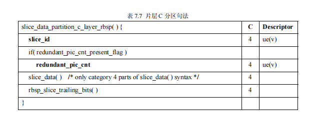
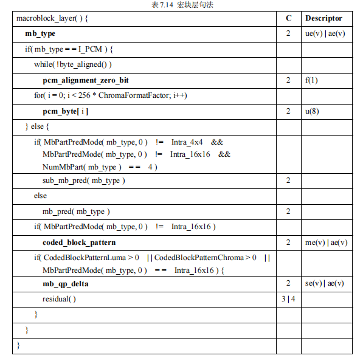

# 音视频协议之H264协议

[TOC]

编码主要是为了将数据进行压缩，这样传输过程就不需要传输过多冗余数据。

H.264 编解码流程主要分为 5 部分：

- 帧间和帧内预测（Estimation）
- 变换（Transform）和反变换
- 量化（Quantization）和反量化
- 熵编码（Entropy Coding）
- 环路滤波（Loop Filter）主要用于滤除方块效应

## h264编码流程

## h264解码流程

## H264基础概念

I帧: 帧内编码帧，I帧通常是每个GOP的第一帧，适度压缩，类似于图片jpg压缩一样的原理。大约可以得到6：1的压缩比。

P帧: 前向预测编码帧，通过图像序列前面已经编码帧的时间冗余信息压缩，称为预测帧，大约可以得到20：1的压缩比

B帧：双向预测内插编码帧,通过前帧和后帧的时间冗余信息压缩，也叫双向预测帧。大约可以得到50:1的压缩比

IDR帧: I帧的一种特殊帧，一个序列的第一个图像叫做 IDR 图像（立即刷新图像）

> 当解码器解码到 IDR 图像时，立即将参考帧队列清空，将已解码的数据全部输出或抛弃，重新查找参数集，开始一个新的序列。这样可以避免前一个序列出现重大错误的问题。

DTS: (Decode Time Stamp) 用于视频的解码序列
PTS: (Presentation Time Stamp)用于视频的显示序列。

GOP: （Group of Picture）两个I帧之间形成的一组图片，就是GOP。一般为编码器设置参数的时候，必须设置gop_size的值，表示两个I帧之间的帧数目，相对来说GOP_size设置越小，画面质量越好。但是相应的容量越大。

> 由于解码必须先获取到I帧，才能获得第一张图像，所以直播秒开的原理就是在CDN缓存一个GOP图片组，这样迅速解码出第一帧图。

## H264编码原理

- 宏块的划分
- 图像分组
- 帧间压缩技术原理。
- 帧内压缩技术原理
- DCT
- CABAC压缩原理。

### 划分宏块

H264默认是使用 16X16 大小的区域作为一个宏块，也可以划分成 8X8 大小。/但为了更高的压缩率，还可以在 16X16 的宏块上更划分出更小的子块。子块的大小可以是 8X16､ 16X8､ 8X8､ 4X8､ 8X4､ 4X4非常的灵活。

### 图像分组

H264编码器会按顺序，每次取出两幅相邻的帧进行宏块比较，计算两帧的相似度。

**其算法是：在相邻几幅图像画面中，一般有差别的像素只有10%以内的点,亮度差值变化不超过2%，而色度差值的变化只有1%以内，我们认为这样的图可以分到一组。**

在这样一组帧中，经过编码后，我们只保留第一帧的完整数据，其它帧都通过参考上一帧计算出来。我们称第一帧为**IDR／I帧**，其它帧我们称为**P／B帧**，这样编码后的数据帧的组我们称为**GOP。**

### 帧间压缩

在H264编码器中将帧分组后，就要计算帧组内物体的运动矢量了。

H264编码器首先按顺序从缓冲区头部取出两帧视频数据，然后进行宏块扫描。当发现其中一幅图片中有物体时，就在另一幅图的邻近位置（搜索窗口中）进行搜索。如果此时在另一幅图中找到该物体，那么就可以计算出物体的运动矢量了。

运动矢量计算出来后，将相同部分减去，就得到了补偿数据。我们最终只需要将补偿数据进行压缩保存，以后在解码时就可以恢复原图了。压缩补偿后的数据只需要记录很少的一点数据。

### 帧内压缩

除了帧间压缩，帧内也要进行数据压缩，帧内数据压缩解决的是空间上的数据冗余。

人眼对图象都有一个识别度，对低频的亮度很敏感，对高频的亮度不太敏感。所以基于一些研究，可以将一幅图像中人眼不敏感的数据去除掉。这样就提出了帧内预测技术。

H264的帧内压缩与JPEG很相似。一幅图像被划分好宏块后，对每个宏块可以进行 9 种模式的预测。找出与原图最接近的一种预测模式。

将原始图像与帧内预测后的图像相减得残差值。再将我们之前得到的预测模式信息一起保存起来，这样我们就可以在解码时恢复原图了。

### DCT

将残差数据做整数离散余弦变换，去掉数据的相关性，进一步压缩数据。

### CABAC压缩

上面的帧内压缩是属于有损压缩技术。也就是说图像被压缩后，无法完全复原。而CABAC属于无损压缩技术。

无损压缩技术大家最熟悉的可能就是哈夫曼编码了，给高频的词一个短码，给低频词一个长码从而达到数据压缩的目的。MPEG-2中使用的VLC就是这种算法，我们以 A-Z 作为例子，A属于高频数据，Z属于低频数据。看看它是如何做的。

CABAC也是给高频数据短码，给低频数据长码。同时还会根据上下文相关性进行压缩，这种方式又比VLC高效很多。

## H264协议

H.264 的功能分为两层，即视频编码层（VCL）和网络提取层（NAL，Network Abstraction Layer）。VCL 数据即编码处理的输出，它表示被压缩编码后的视频数据序列。在 VCL 数据传输或存储之前，这些编码的 VCL 数据，先被映射或封装进 NAL 单元中。

### NALU结构

每个 NAL 单元包括一个原始字节序列负荷（RBSP）、一组对应于视频编码数据的 NAL 头信息。即`NALU=NALU HEADER + RBSP（raw byte sequence payload）`

#### NALU头结构

#### RBSP结构

RBSP=SODB（string of data bits 数据比特串，编码后原始数据） + trailing bits（一个1若干0，进行对齐）

### H264层级结构

## h264语法表

### 基于上下文自适应的二进制算术熵编码

TODO

### 基于上下文自适应的可变长熵编码

TODO

### Golomb 熵编码

TODO

### 句法表

句法表定义了 H.264 的句法，指明在码流中依次出现的句法元素及它们出现的条件、提取描述子等。就象前文所提，句法表是分层嵌套的。

在句法表中的 C 字段表示该句法元素的分类，这是为片分区服务的，句法元素分类的具体含义在下列表中详细介绍。Descriptor 指定对应句法元素的描述子。

定义了如下几种描述子：

a) ae(v) 基于上下文自适应的二进制算术熵编码

b) b(8) 读进连续的 8 个比特

c) ce(v) 基于上下文自适应的可变长熵编码

d) f(n) 读进连续的 n 个比特 

e) i(n)/i(v) 读进连续的若干比特，并把它们解释为有符号整数

f) me(v) 映射指数 Golomb 熵编码

g) se(v) 有符号指数 Golomb 熵编码

h) te(v) 截断指数 Golomb 熵编码

i) u(n)/u(v) 读进连续的若干比特，并将它们解释为无符号整数

j) ue(v) 无符号指数 Golomb 熵编码

#### nal unit句法表

如上，解决起始码数据竞争问题，是通过改写rbsp中的`00 00`数据为`00 00 03`实现的。因此解析的时候有对数据进行操作。

**forbidden_zero_bit** 等于 0 

**nal_ref_idc** 指示当前 NAL 的优先级。取值范围为 0-3, ,值越高,表示当前 NAL 越重要,需要优先受

到保护。H.264 规定如果当前 NAL 是属于参考帧的片，或是序列参数集，或是图像参数集这些重要的数据单位时，本句法元素必须大于 0。但在大于 0 时具体该取何值，却没有进一步规定,通信双方

可以灵活地制定策略。

**nal_unit_type** 指明当前 NAL unit 的类型

**rbsp_byte[i]** RBSP 的第 i 个字节。RBSP 指原始字节载荷，它是 NAL 单元的数据部分的封装格式，

封装的数据来自 SODB（原始数据比特流）。SODB 是编码后的原始数据，SODB 经封装为 RBSP 后

放入 NAL 的数据部分。下面介绍一个 RBSP 的生成顺序。

从 SODB 到 RBSP 的生成过程：

如果 SODB 内容是空的，生成的 RBSP 也是空的

否则，RBSP 由如下的方式生成：

1） RBSP 的第一个字节直接取自 SODB 的第 1 到 8 个比特，（RBSP 字节内的比特按照从左到

右对应为从高到低的顺序排列，most significant）,以此类推，RBSP 其余的每个字节都直接

取自 SODB 的相应比特。RBSP 的最后一个字节包含 SODB 的最后几个比特，及如下的

rbsp_trailing_bits() 

2） rbsp_trailing_bits()的第一个比特是 1,接下来填充 0，直到字节对齐。（填充 0 的目的也是为了

字节对齐）

3） 最后添加若干个 cabac_zero_word(其值等于 0x0000) 

**emulation_prevention_three_byte** NAL 内部为防止与起始码竞争而引入的填充字节 ,值为 0x03。

#### sps句法表

**profile_idc、 level_idc** 指明所用 profile、level。

#### pps

不分区片

slice a

slice b

slice c

trail

slice header

要注意的是在帧场自适应模式下，宏块都是成对出现，这时本句法元素表示的是第几个宏块对，对

应的第一个宏块的真实地址应该是

 2 * **first_mb_in_slice**

**slice_type** 指明片的类型，具体语义见表

reorder

weight

marking

slice data

macro layer

**mb_type** 指明当前宏块的类型。H.264规定，不同的片中允许出现的宏块类型也不同。下表指明在

各种片类型中允许出现的宏块种类。

pred mb

sub pred mb

residual

cavlc

cabac

