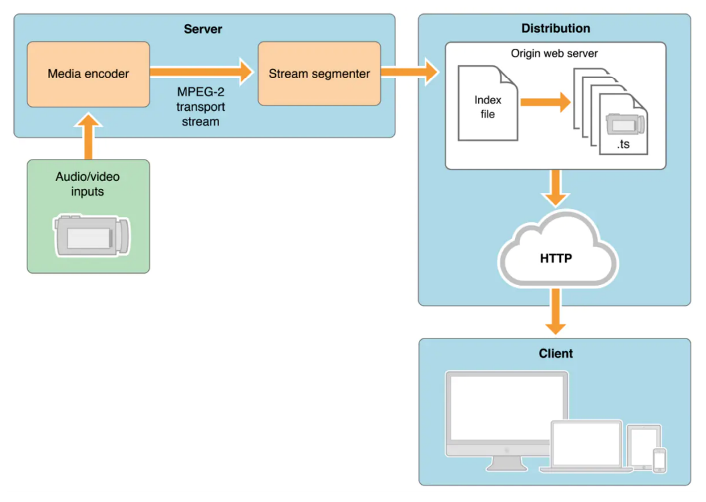
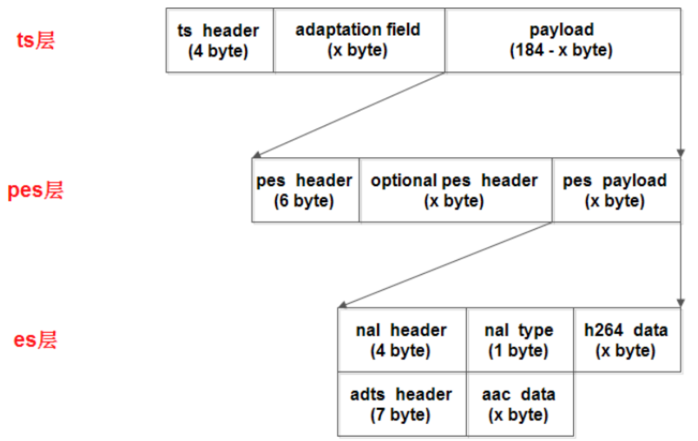
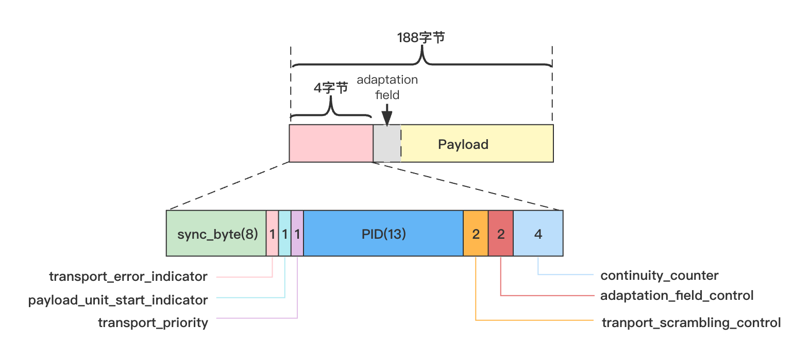
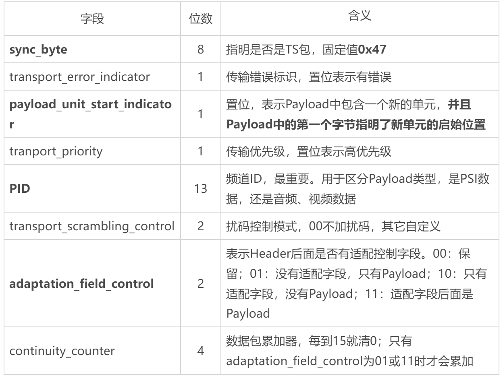
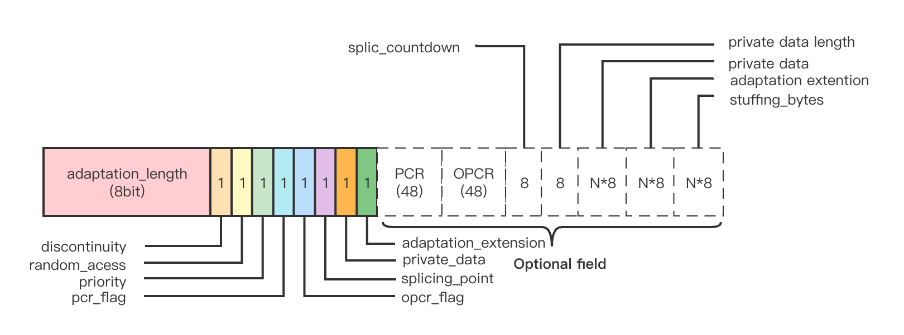
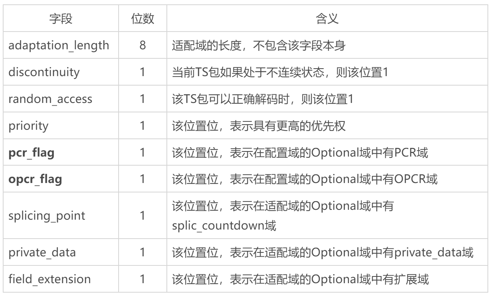
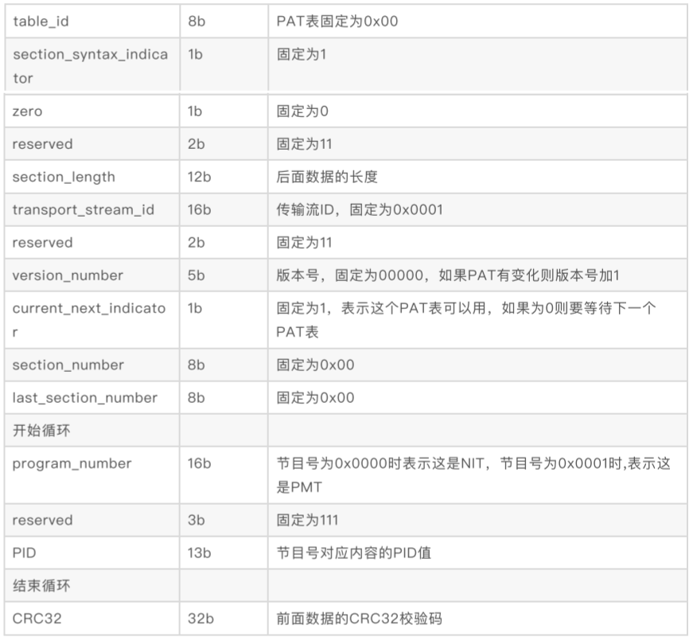
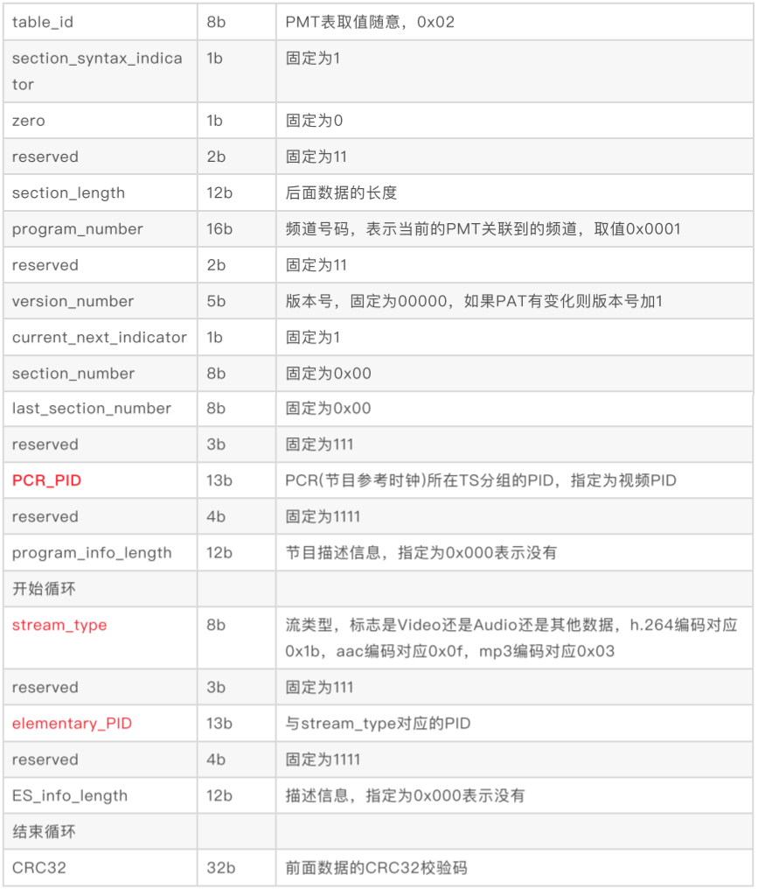
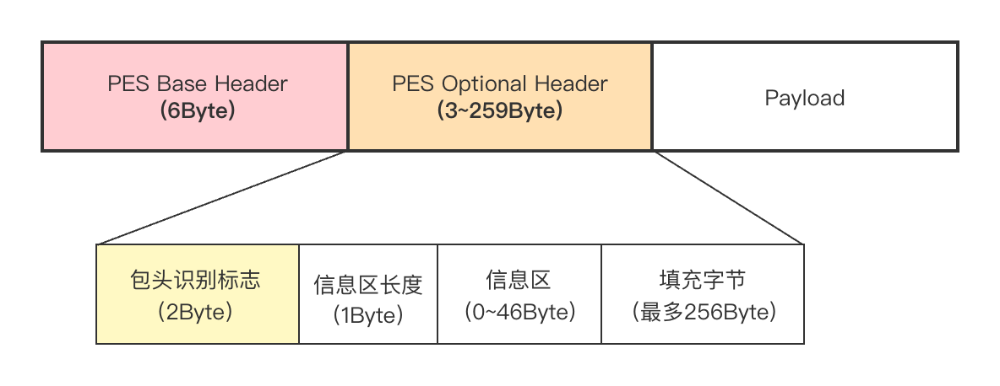
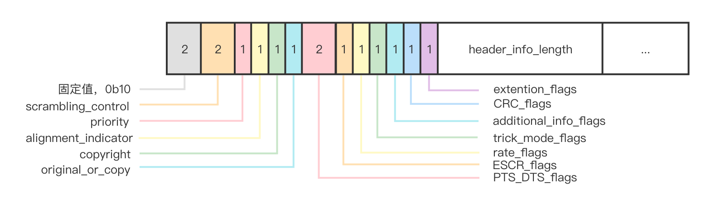

# 流媒体协议之HLS协议

[TOC]

## HLS概述

作为**Apple**提出的一种基于**HTTP**的协议,**HLS(HTTP Live Streaming)用于解决实时音视频流的传输。尤其是在移动端,由于iOS/H5**不支持**flash**,使得**HLS**成了移动端实时视频流传输的首选。**HLS**经常用在直播领域,一些国内的直播云通常用**HLS**拉流。



- **流分割器(Stream Segmenter)负责将编码器输出的MPEG-2 TS**流分割为一系列**连续的、长度均等的**小**TS**文件,并依次发送至内容分发组件中的**Web**服务器进行存储。
- 为了跟踪播放过程中媒体文件的可用性和当前位置,流分割器还需创建一个含有指向这些小**TS**文件指针的索引文件,同样放置于**Web**服务器之中。m3u8文件
- **TS**文件中必须仅包含一个**MPEG-2**节目,在每个文件的开头应包含一个**节目关联表(PAT)和一个节目映射表(PMT)**,包含视频的文件中还必须含有至少一个**关键帧和其他足够信息(如序列头)用以完成解码器的初始化。索引文件采用扩展的M3U**播放列表格式,后缀名为 **.m3u8** 。

## HLS之M3U8

m3u8为索引文件。

|        配置项         |                             作用                             |
| :-------------------: | :----------------------------------------------------------: |
|        #EXTM3U        |         每个 M3U 文件第一行必须是这个 tag,起标示作用         |
|    #EXT-X-VERSION     |        该属性可以没有,目前主要是 version 3,最新的是 7        |
| #EXT-X-MEDIA-SEQUENCE | 每一个 media URI 在 PlayList 中只有唯一的序号,相邻之间序号+1,一个 media URI 并不是必须要包含的,如果没有,默认为 0 |
| #EXT-X-TARGETDURATION | 所有切片的最大时长。有些 Apple 设备这个参数不正确会无法播放。SRS 会自动计算出 ts 文件的最大时长,然后更新 m3u8 时会自动更新这个值。用户不必自己配置 |
|        #EXTINF        | ts 切片的实际时长,SRS 提供配置项 hls_fragment,但实际上的 ts 时长还受 gop 影响 |
|     ts 文件的数目     | SRS 可配置 hls_window(单位是秒,不是数量),指定 m3u8 中保存多少个切片。譬如,每个 ts 切片为 10 秒,窗口为 60 秒,那么 m3u8 中最多保存 6 个 ts 切片,SRS 会自动清理旧的切片 |
|    livestream-0.ts    | SRS 会自动维护 ts 切片的文件名,在编码器重推之后,这个编号会继续增长,保证流的连续性。直到 SRS 重启,这个编号才重置为 0 |

## HLS之TS

### ts，pes，es关系图




* **ts包为188字节。**
* ts包包含header+adaptation field+payload，header用于描述Payload中数据的类型，payload既可以是PSI(Program Specific Information)元数据 也可以是音视频数据
* PSI/SI数据种类做了精简 只保留了两种最基本的PSI数据，也就是PAT(Program Association Table)和PMT(Program Map Table)，其中PAT指明PMT使用的PID，PMT指明音视频流的pid

### Ts header



* 由上可知，假设adaptation为x，则`4+x+payload length = 188`, 当adaptation_filed_control为11B时，有该公式。

* pid为payload的数据类型，比如0x00为元数据信息。

以下为各字段信息：



适配域如下：



适配域含义如下：



### PAT和PMT的作用：

* PAT 和 PMT 表是没有 adaptation field 的，不够的⻓度直接补 0xff 即可。

* 播放器播放TS流的基本过程 ：解析TS流时，首选获得PAT信息，之后通过PAT找到PMT，在通过PMT找到音视频流，PAT数据的PID是固定值0x00解析TS流时，首先需要对每个传过来的TS包进行遍历，直到找到TS Header中的PID值为0x00的包，然后从Payload中找到PAT数据，再找到流。**注TS Header中adaptation_field_control域指明存在adaption_field域，则在Payload中要跳过该域；另外，如果在TS Header中payload_unit_start_indicator置位，则说明真实数据之前还有一个字节的指针域，跳过这个域才能拿到真正的数据**
* 视频流和⾳频流都需要加 adaptation field，通常加在⼀个帧的第⼀个 ts包和最后⼀个 ts 包⾥，中间的 ts 包不加。

#### PAT格式如图



开始循环和结束循环的意思为中间字段为一组按组内顺序重复。

#### PMT格式如图



开始循环和结束循环的意思为中间字段为一组按组内顺序重复。

### pes



* PES 由Base Header，Optional Header以及Payload组成。

* **Base Header 分为3个域，分别为start_code 用于标识PES包的开始，stream_id用于标识是音频流还是视频流**

* stream id 0xCD~0xDF标识音频 0xE0~0xEF标识视频，packet_length PES的长度，这个长度是从packet_length 字段后的第一个字节开始算起，此值为0表示长度不受限制


#### pes optional header



header_info_length （1字节）标识了Optional Header 中是否有信息区域，如果值不为0的话说明后面还跟着信息区。而信息区中的内容就是根据前面Optional Header的几个标志位来决定 比如是否包含PTS DTS

###### 点播视频 dts 算法：

dts = 初始值 + 90000 / video_frame_rate ，初始值任意，但建议不为 0，video_frame_rate 就是帧率，⽐如 23、30。

pts 和 dts 是 以  time scale 为 单 位 的 ， 1s = 90000 time scale ， ⼀ 帧 就 应 该 是90000/video_frame_rate 个 timescale。

⽤⼀帧的 timescale 除以采样频率就可以转换为⼀帧的播放时⻓。

###### 点播⾳频 dts 算法：

dts = 初 始 值 + (90000 * audio_samples_per_frame) / audio_sample_rate ，audio_samples_per_frame 这 个 值 与 编 解 码 相 关 ， aac 取 值 1024 ， mp3 取 值 1158 ，audio_sample_rate 是采样率，⽐如 24000、41000. AAC ⼀般解码出来是每声道 1024 个 sample，也就是说⼀帧的时⻓为 1024/sample_rate 秒。所以每⼀帧时间戳依次 0,1024/sample_rate, ...,1024*n/sample_rate 秒 。

注：直播视频的 dts 和 pts 应该直接⽤直播数据流中的时间，不应该按公式计算。

## SRS的HLS源码解析

SrsRtmpConn::publishing该函数是RTMP的实际推流函数。现在主要分析HLS协议相关，分析RTMP请看其他文章。

### 初始化相关HLS

```
srs_error_t SrsRtmpConn::publishing(SrsLiveSource* source)
{
	...
    if ((err = acquire_publish(source)) == srs_success) {
        SrsPublishRecvThread rtrd(rtmp, req, srs_netfd_fileno(stfd), 0, this, source, _srs_context->get_id());
        err = do_publishing(source, &rtrd);
        rtrd.stop();
    }
	...    
    return err;
}

srs_error_t SrsRtmpConn::acquire_publish(SrsLiveSource* source)
{
    ...
    err = source->on_publish(); // 这里会去触发hls相关
	...
    return err;
}

srs_error_t SrsLiveSource::on_publish()
{
	...
    if ((err = hub->on_publish()) != srs_success) {
        return srs_error_wrap(err, "hub publish");
    }
    ...
}

srs_error_t SrsOriginHub::on_publish()
{
    ...
    if ((err = hls->on_publish()) != srs_success) {
        return srs_error_wrap(err, "hls publish");
    }
    ...
    return err;
}

srs_error_t SrsHls::on_publish()
{
    ...
    // 这里干的活多，初始化muxer 配置更新，打开文件
    if ((err = controller->on_publish(req)) != srs_success) {
        return srs_error_wrap(err, "hls: on publish");
    }
	...
}

srs_error_t SrsHlsController::on_publish(SrsRequest* req)
{
    ...
    if ((err = muxer->on_publish(req)) != srs_success) { // 异步处理相关
        return srs_error_wrap(err, "muxer publish");
    }
    // 配置相关
    if ((err = muxer->update_config(req, entry_prefix, path, m3u8_file, ts_file, hls_fragment,
        hls_window, ts_floor, hls_aof_ratio, cleanup, wait_keyframe,hls_keys,hls_fragments_per_key,
        hls_key_file, hls_key_file_path, hls_key_url)) != srs_success ) {
        return srs_error_wrap(err, "hls: update config");
    }
    
    if ((err = muxer->segment_open()) != srs_success) { // 文件相关 这个之后会分析，放之后分析了
        return srs_error_wrap(err, "hls: segment open");
    }
    ...
    return err;
}
```

### 推流，流分割

在初始化时, 会启动该协程，接收RTMP消息

```
SrsPublishRecvThread rtrd(rtmp, req, srs_netfd_fileno(stfd), 0, this, source, _srs_context->get_id());
        err = do_publishing(source, &rtrd);
```

如下：

```
srs_error_t SrsPublishRecvThread::consume(SrsCommonMessage* msg)
{
    ...
    err = _conn->handle_publish_message(_source, msg);
    ...
    return err;
}

srs_error_t SrsRtmpConn::handle_publish_message(SrsLiveSource* source, SrsCommonMessage* msg)
{
    srs_error_t err = srs_success;
    ... 
    // 上面是解包逻辑
    // video, audio, data message 
    if ((err = process_publish_message(source, msg)) != srs_success) {
        return srs_error_wrap(err, "rtmp: consume message");
    }
    
    return err;
}

srs_error_t SrsRtmpConn::process_publish_message(SrsLiveSource* source, SrsCommonMessage* msg)
{
    ...
    if ((err = source->on_audio(msg)) != srs_success) { // 音频
    	return srs_error_wrap(err, "rtmp: consume audio");
    }
    ...
    if ((err = source->on_video(msg)) != srs_success) { // 视频 只分析一个 其余类似
    	return srs_error_wrap(err, "rtmp: consume video");
    }
    ...
    if ((err = source->on_meta_data(msg, metadata)) != srs_success) { // 元数据
    	return srs_error_wrap(err, "rtmp: consume metadata");
    }
    ...
    return err;
}

srs_error_t SrsLiveSource::on_video(SrsCommonMessage* shared_video)
{
	...
    return on_frame(&msg);
}

srs_error_t SrsLiveSource::on_frame(SrsSharedPtrMessage* msg)
{
	...
    if (m->is_audio()) {
        err = on_audio_imp(m); // 音频处理
    } else {
        err = on_video_imp(m); // 视频处理
    }
    srs_freep(m);
    
    return err;
}

srs_error_t SrsLiveSource::on_video_imp(SrsSharedPtrMessage* msg)
{
    srs_error_t err = srs_success;
	...
    if ((err = hub->on_video(msg, is_sequence_header)) != srs_success) { // 传给HLS
        return srs_error_wrap(err, "hub consume video");
    }
	...
    return err;
}

srs_error_t SrsOriginHub::on_video(SrsSharedPtrMessage* shared_video, bool is_sequence_header)
{
	...
    if ((err = hls->on_video(msg, format)) != srs_success) { // hls处理
        ...
    }
    
    ...
    return err;
}

srs_error_t SrsHls::on_video(SrsSharedPtrMessage* shared_video, SrsFormat* format)
{
    srs_error_t err = srs_success;
	...
    int64_t dts = video->timestamp * 90;
    if ((err = controller->write_video(format->video, dts)) != srs_success) {
        return srs_error_wrap(err, "hls: write video");
    }
    ...
    return err;
}

srs_error_t SrsHlsController::write_video(SrsVideoFrame* frame, int64_t dts)
{
    srs_error_t err = srs_success;
    ...

    // write video to cache.
    if ((err = tsmc->cache_video(frame, dts)) != srs_success) { // 缓存
        return srs_error_wrap(err, "hls: cache video");
    }
    
    // when segment overflow, reap if possible.
    if (muxer->is_segment_overflow()) {
        // do reap ts if any of:
        //      a. wait keyframe and got keyframe.
        //      b. always reap when not wait keyframe.
        if (!muxer->wait_keyframe() || frame->frame_type == SrsVideoAvcFrameTypeKeyFrame) {
            // reap the segment, which will also flush the video.
            if ((err = reap_segment()) != srs_success) { // 写
                return srs_error_wrap(err, "hls: reap segment");
            }
        }
    }
    
    // flush video when got one
    if ((err = muxer->flush_video(tsmc)) != srs_success) { // 更新
        return srs_error_wrap(err, "hls: flush video");
    }
    
    return err;
}

srs_error_t SrsHlsController::reap_segment()
{
    srs_error_t err = srs_success;
    
    // TODO: flush audio before or after segment?
    // TODO: fresh segment begin with audio or video?
    
    // close current ts.
    if ((err = muxer->segment_close()) != srs_success) {
        // When close segment error, we must reopen it for next packet to write.
        srs_error_t r0 = muxer->segment_open();
        if (r0 != srs_success) {
            srs_warn("close segment err %s", srs_error_desc(r0).c_str());
            srs_freep(r0);
        }

        return srs_error_wrap(err, "hls: segment close");
    }
    
    // open new ts.
    if ((err = muxer->segment_open()) != srs_success) {
        return srs_error_wrap(err, "hls: segment open");
    }
    
    // segment open, flush video first.
    if ((err = muxer->flush_video(tsmc)) != srs_success) {
        return srs_error_wrap(err, "hls: flush video");
    }
    
    // segment open, flush the audio.
    // @see: ngx_rtmp_hls_open_fragment
    /* start fragment with audio to make iPhone happy */
    if ((err = muxer->flush_audio(tsmc)) != srs_success) {
        return srs_error_wrap(err, "hls: flush audio");
    }
    
    return err;
}

srs_error_t SrsHlsController::reap_segment()
{
    srs_error_t err = srs_success;
    
    // close current ts.
    if ((err = muxer->segment_close()) != srs_success) { // 关闭ts 以及更新m3u8 以及重命名ts
		...
    }
    
    // open new ts.
    if ((err = muxer->segment_open()) != srs_success) { // 打开ts
        return srs_error_wrap(err, "hls: segment open");
    }
    
    // segment open, flush video first.
    if ((err = muxer->flush_video(tsmc)) != srs_success) { // 视频 按照协议写入
        return srs_error_wrap(err, "hls: flush video");
    }
    
    // segment open, flush the audio.
    // @see: ngx_rtmp_hls_open_fragment
    /* start fragment with audio to make iPhone happy */
    if ((err = muxer->flush_audio(tsmc)) != srs_success) { // 音频 按照协议写入
        return srs_error_wrap(err, "hls: flush audio");
    }
    
    return err;
}
```

### 拉流

hls也是http协议。

* 拉流初始化

```
srs_error_t SrsServerAdapter::run(SrsWaitGroup* wg)
{
    srs_error_t err = srs_success;

    // Initialize the whole system, set hooks to handle server level events.
    if ((err = srs->initialize()) != srs_success) { // 这里会去注册路由
        return srs_error_wrap(err, "server initialize");
    }
	...
    return err;
}

srs_error_t SrsServer::initialize()
{
	...

    if ((err = http_server->initialize()) != srs_success) { // http服务器初始化
        return srs_error_wrap(err, "http server initialize");
    }
    
    return err;
}

srs_error_t SrsHttpServer::initialize()
{
    ...
    // 静态路由初始化
    if ((err = http_static->initialize()) != srs_success) {
        return srs_error_wrap(err, "http static");
    }
    
    return err;
}

srs_error_t SrsHttpStaticServer::initialize()
{
    srs_error_t err = srs_success;
    
    if (!default_root_exists) {
        // add root
        std::string dir = _srs_config->get_http_stream_dir();
        if ((err = mux.handle("/", new SrsVodStream(dir))) != srs_success) { // vod路由注册，http请求到来，会触发serve_http函数
            return srs_error_wrap(err, "mount root dir=%s", dir.c_str());
        }
        srs_trace("http: root mount to %s", dir.c_str());
    }
    
    return err;
}
```

### 拉流

客户端发送hls请求（http）。

```
srs_error_t SrsHttpConn::cycle()
{
    srs_error_t err = do_cycle();
}

srs_error_t SrsHttpConn::do_cycle()
{
    srs_error_t err = srs_success;
    
    ...
    err = process_requests(&last_req);
    ...
    
    return err;
}

srs_error_t SrsHttpConn::process_request(ISrsHttpResponseWriter* w, ISrsHttpMessage* r, int rid)
{
    srs_error_t err = srs_success;
    ...
    if ((err = cors->serve_http(w, r)) != srs_success) { // 跨域
        return srs_error_wrap(err, "cors serve");
    }
    ...
    return err;
}

srs_error_t SrsHttpCorsMux::serve_http(ISrsHttpResponseWriter* w, ISrsHttpMessage* r)
{
	...
    return next_->serve_http(w, r); // next为auth 以上代码是为了跨域
}

srs_error_t SrsHttpAuthMux::serve_http(ISrsHttpResponseWriter* w, ISrsHttpMessage* r)
{
	...
    return next_->serve_http(w, r); // next为http_server 以上代码是为了auth
}

srs_error_t SrsHttpServer::serve_http(ISrsHttpResponseWriter* w, ISrsHttpMessage* r)
{
    srs_error_t err = srs_success;
    ...
    // Try http stream first, then http static if not found.
    ISrsHttpHandler* h = NULL;
    if ((err = http_stream->mux.find_handler(r, &h)) != srs_success) { // 这里会去找hander 在SrsHttpStreamServer::http_mount里面注册的
        return srs_error_wrap(err, "find handler");
    }
    if (!h->is_not_found()) {
        return http_stream->mux.serve_http(w, r);
    }
	...
    // Use http static as default server.
    return http_static->mux.serve_http(w, r);
}

srs_error_t SrsHttpServeMux::serve_http(ISrsHttpResponseWriter* w, ISrsHttpMessage* r)
{
    srs_error_t err = srs_success;
    
    ISrsHttpHandler* h = NULL;
    if ((err = find_handler(r, &h)) != srs_success) { // 再找一次
        return srs_error_wrap(err, "find handler");
    }
    
    srs_assert(h);
    if ((err = h->serve_http(w, r)) != srs_success) { // 触发实际处理函数
        return srs_error_wrap(err, "serve http");
    }
    
    return err;
}

srs_error_t SrsHttpFileServer::serve_http(ISrsHttpResponseWriter* w, ISrsHttpMessage* r)
{
	...
    // handle file according to its extension.
    // use vod stream for .flv/.fhv
    if (srs_string_ends_with(fullpath, ".flv") || srs_string_ends_with(fullpath, ".fhv")) {
        return serve_flv_file(w, r, fullpath); // flv文件
    } else if (srs_string_ends_with(fullpath, ".mp4")) {
        return serve_mp4_file(w, r, fullpath); // mp4文件
    } else if (srs_string_ends_with(upath, ".m3u8")) {
        return serve_m3u8_file(w, r, fullpath); // m3u8文件
    } else if (srs_string_ends_with(upath, ".ts")) {
        return serve_ts_file(w, r, fullpath); // ts文件
    }
    
    // serve common static file.
    return serve_file(w, r, fullpath); // 普通文件
}
```

后续就是传输m3u8和ts文件了。供客户端渲染展示

