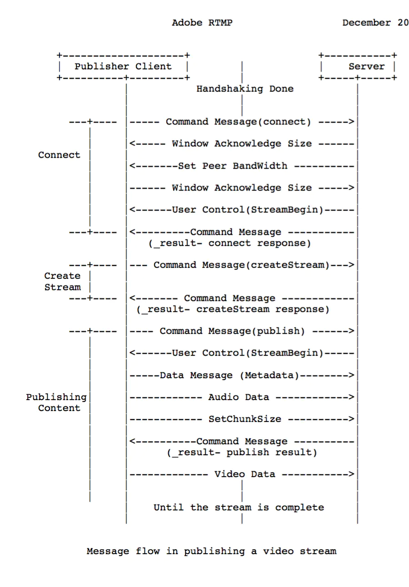
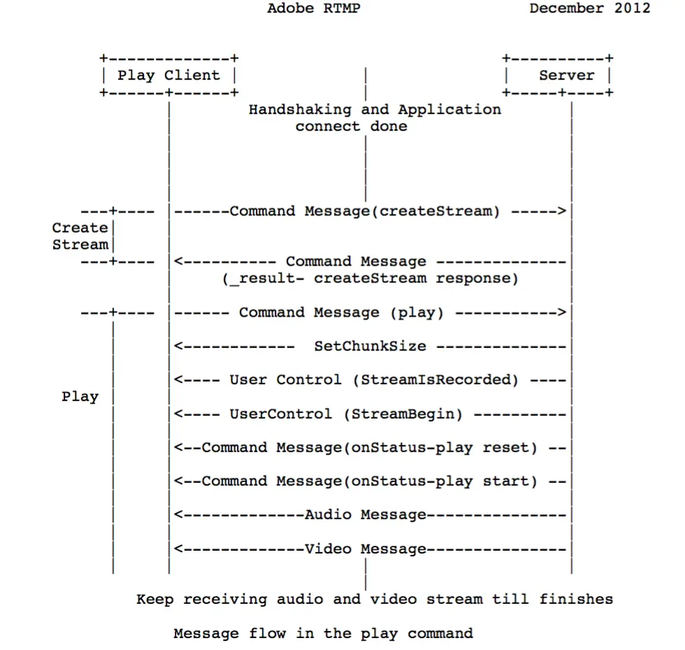

# 流媒体协议之RTMP

## RTMP协议

RTMP（Real Time Messaging Protocol） 是由 Adobe 公司基于 Flash Player 播放器对应的音视频 flv 封装格式提出的一种，基于`TCP `的数据传输协议。本身具有稳定、兼容性强、高穿透的特点。常被应用于流媒体直播、点播等场景。常用于推推流方（主播）的稳定传输需求。

需知：RTMP基于TCP，因此建立在TCP的connect之后。

## RTMP推流



* 首先第一步是TCP的connect连接完毕
* 客户端发起握手协议，handshake。
* 服务端接收到连接命令后，发送窗口应答大小确认信息(Window Acknowledgement Size),配置对端带宽(Set Peer Bandwidth), 发送用户控制协议(Stream Begin)告知流开始信息，并发送连接接收响应信息(_result-connect response)_
* 客户端发起创建流通道（createstream）
* _服务器接收到创建流通到后，响应创建流(_result-creatStream response)
* 发布端发起发布命令消息（public）并准备开始传输元数据消息（Metadata）、音频数据(AUdio data)
* 服务端接收到发布命令后，发送响应消息
* 发送端配置chunk size、开始发送视频数据
* 服务端返回发布结果信息，开始接收音视频流

其中srs的流程如下

```
SrsRtmpConn::do_cycle() // func
rtmp->handshake()
expect_message<SrsConnectAppPacket>(&msg, &pkt) // 等待connect包
SrsRtmpConn::service_cycle() // func
rtmp->set_window_ack_size(out_ack_size)
rtmp->set_in_window_ack_size(in_ack_size)
rtmp->set_peer_bandwidth((int)(2.5 * 1000 * 1000), 2)
rtmp->set_chunk_size(chunk_size)
rtmp->response_connect_app(req, local_ip.c_str())
rtmp->on_bw_done() // onBWDone
SrsRtmpConn::stream_service_cycle() // func
SrsRtmpServer::identify_client // func 
SrsFMLEStartPacket(releaseStream)->result
rtmp->start_fmle_publish(info->res->stream_id)
expect_message<SrsFMLEStartPacket>(&msg, &pkt)
->SrsFMLEStartResPacket // reponse
expect_message<SrsCreateStreamPacket>(&msg, &pkt)
->SrsCreateStreamResPacket // reponse
expect_message<SrsPublishPacket>(&msg, &pkt)
SrsOnStatusCallPacket* pkt = new SrsOnStatusCallPacket(); // onFCPublish
SrsOnStatusCallPacket* pkt = new SrsOnStatusCallPacket(); // onStatus
然后第一个数据是meta数据
```

## RTMP拉流



* 首先第一步是TCP的connect连接完毕
* 客户端发起握手协议，handshake。
* 客户端发送createStream命令
* 服务端接收到命令，发送响应信号
* 客户端发送命令消息（play）
* 服务器端接收到播放命令play后，配置chunk大小，发送用户控制协议（StreamIsRecorded、StreamBegin）通知是否录制流，流已开启标志，之后发送播放命令响应消息（刷新当前状态、通知播放开始），这里如果play命令成功，服务端回复onStatus 命令消息 NetStream.Play.Start和NetStream.Play.Reset，其中NetStream.Play.Reset只有当客户端发送的play命令里设置了reset时才会发送，如果要播放的流没有找到，服务端会发送onStatus消息NetStream.Play.StreamNotFound。
  服务器端发送音视频消息到客户端，客户端开始播放

srs源码流程如下：

```
SrsRtmpConn::do_cycle() // func
rtmp->handshake()
expect_message<SrsConnectAppPacket>(&msg, &pkt) // 等待connect包
SrsRtmpConn::service_cycle() // func
rtmp->set_window_ack_size(out_ack_size)
rtmp->set_in_window_ack_size(in_ack_size)
rtmp->set_peer_bandwidth((int)(2.5 * 1000 * 1000), 2)
rtmp->set_chunk_size(chunk_size)
rtmp->response_connect_app(req, local_ip.c_str())
rtmp->on_bw_done() // onBWDone
SrsRtmpConn::stream_service_cycle() // func
SrsRtmpServer::identify_client // func 
expect_message<SrsCreateStreamPacket>(&msg, &pkt)
->SrsCreateStreamResPacket // reponse
SrsPlayPacket(); // play
SrsUserControlPacket(); // StreamBegin
SrsOnStatusCallPacket(); // onStatus(NetStream.Play.Reset)
SrsOnStatusCallPacket(); // onStatus(NetStream.Play.Start)
SrsSampleAccessPacket(); // |RtmpSampleAccess(false, false)
SrsOnStatusDataPacket(); // onStatus(NetStream.Data.Start)
```

类似流程如上，具体需要进行抓包，以及具体分析。

## RTMP握手

