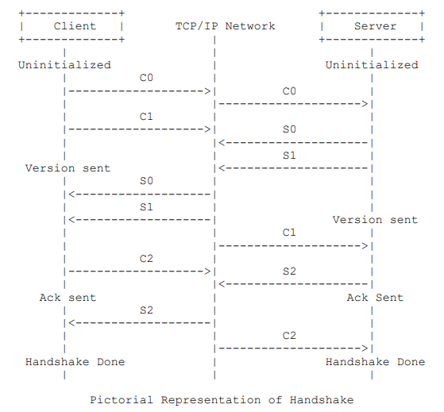
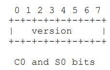
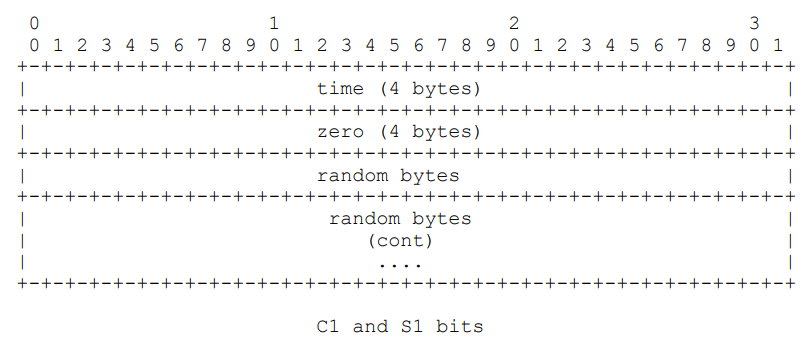
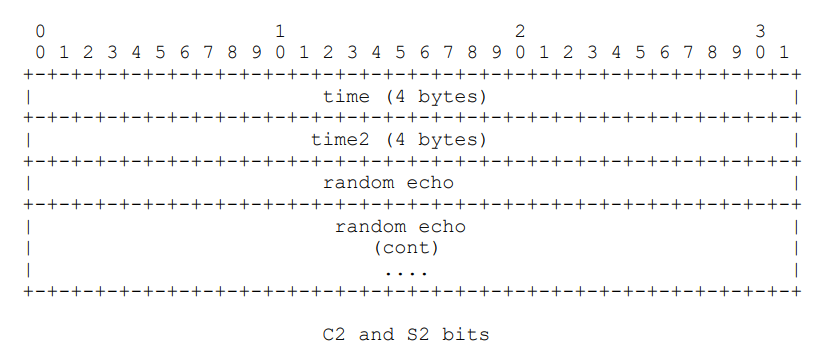

# 流媒体协议之RTMP

[TOC]

## RTMP协议

RTMP（Real Time Messaging Protocol） 是由 Adobe 公司基于 Flash Player 播放器对应的音视频 flv 封装格式提出的一种，基于`TCP `的数据传输协议。本身具有稳定、兼容性强、高穿透的特点。常被应用于流媒体直播、点播等场景。常用于推推流方（主播）的稳定传输需求。

需知：RTMP基于TCP，因此建立在TCP的connect之后。

## RTMP推流


* 首先第一步是TCP的connect连接完毕
* 客户端发起握手协议，handshake。
* 服务端接收到连接命令后，发送窗口应答大小确认信息(Window Acknowledgement Size),配置对端带宽(Set Peer Bandwidth), 发送用户控制协议(Stream Begin)告知流开始信息，并发送连接接收响应信息(_result-connect response)_
* 客户端发起创建流通道（createstream）
* _服务器接收到创建流通到后，响应创建流(_result-creatStream response)
* 发布端发起发布命令消息（public）并准备开始传输元数据消息（Metadata）、音频数据(AUdio data)
* 服务端接收到发布命令后，发送响应消息
* 发送端配置chunk size、开始发送视频数据
* 服务端返回发布结果信息，开始接收音视频流

### 其中srs的推流流程如下

```
SrsRtmpConn::do_cycle() // func
rtmp->handshake()
expect_message<SrsConnectAppPacket>(&msg, &pkt) // 等待connect包
SrsRtmpConn::service_cycle() // func
rtmp->set_window_ack_size(out_ack_size)
rtmp->set_in_window_ack_size(in_ack_size)
rtmp->set_peer_bandwidth((int)(2.5 * 1000 * 1000), 2)
rtmp->set_chunk_size(chunk_size)
rtmp->response_connect_app(req, local_ip.c_str())
rtmp->on_bw_done() // onBWDone
SrsRtmpConn::stream_service_cycle() // func
SrsRtmpServer::identify_client // func 
SrsFMLEStartPacket(releaseStream)->result
rtmp->start_fmle_publish(info->res->stream_id)
expect_message<SrsFMLEStartPacket>(&msg, &pkt)
->SrsFMLEStartResPacket // reponse
expect_message<SrsCreateStreamPacket>(&msg, &pkt)
->SrsCreateStreamResPacket // reponse
expect_message<SrsPublishPacket>(&msg, &pkt)
SrsOnStatusCallPacket* pkt = new SrsOnStatusCallPacket(); // onFCPublish
SrsOnStatusCallPacket* pkt = new SrsOnStatusCallPacket(); // onStatus
然后第一个数据是meta数据
```

## RTMP拉流


* 首先第一步是TCP的connect连接完毕
* 客户端发起握手协议，handshake。
* 客户端发送createStream命令
* 服务端接收到命令，发送响应信号
* 客户端发送命令消息（play）
* 服务器端接收到播放命令play后，配置chunk大小，发送用户控制协议（StreamIsRecorded、StreamBegin）通知是否录制流，流已开启标志，之后发送播放命令响应消息（刷新当前状态、通知播放开始），这里如果play命令成功，服务端回复onStatus 命令消息 NetStream.Play.Start和NetStream.Play.Reset，其中NetStream.Play.Reset只有当客户端发送的play命令里设置了reset时才会发送，如果要播放的流没有找到，服务端会发送onStatus消息NetStream.Play.StreamNotFound。
  服务器端发送音视频消息到客户端，客户端开始播放

### srs源码拉流流程如下：

```
SrsRtmpConn::do_cycle() // func
rtmp->handshake()
expect_message<SrsConnectAppPacket>(&msg, &pkt) // 等待connect包
SrsRtmpConn::service_cycle() // func
rtmp->set_window_ack_size(out_ack_size)
rtmp->set_in_window_ack_size(in_ack_size)
rtmp->set_peer_bandwidth((int)(2.5 * 1000 * 1000), 2)
rtmp->set_chunk_size(chunk_size)
rtmp->response_connect_app(req, local_ip.c_str())
rtmp->on_bw_done() // onBWDone
SrsRtmpConn::stream_service_cycle() // func
SrsRtmpServer::identify_client // func 
expect_message<SrsCreateStreamPacket>(&msg, &pkt)
->SrsCreateStreamResPacket // reponse
SrsPlayPacket(); // play
SrsUserControlPacket(); // StreamBegin
SrsOnStatusCallPacket(); // onStatus(NetStream.Play.Reset)
SrsOnStatusCallPacket(); // onStatus(NetStream.Play.Start)
SrsSampleAccessPacket(); // |RtmpSampleAccess(false, false)
SrsOnStatusDataPacket(); // onStatus(NetStream.Data.Start)
```

类似流程如上，具体需要进行抓包，以及具体分析。

## RTMP握手



* 握手分为简单握手，和复杂握手，流程一样，数据有区别。

- 客户端要向服务器发送**C0、C1、C2**(按序)三个 chunk,服务器向客户端发送**S0、S1、S2**(按序)三个 chunk,然后才能进行有效的信息传输。RTMP 协议本身并没有规定这 6 个**Message**的具体传输顺序,但 RTMP 协议的实现者需要保证这⼏点:
  - 客户端要等收到 S1 之后才能发送 C2
  - 客户端要等收到 S2 之后才能发送其他信息(控制信息和真实音视频等数据)
  - 服务端要等到收到 C0 之后发送 S1
  - 服务端必须等到收到 C1 之后才能发送 S2
  - 服务端必须等到收到 C2 之后才能发送其他信息(控制信息和真实音视频等数据)

但一般情况是

|      发送端      | 数据流向 | 接收端 |
| :--------------: | :------: | :----: |
| client（c0+c1）  |    ->    | server |
| server(s0+s1+s2) |    ->    | client |
|    client(c2)    |    ->    | server |

其中srs服务器对c2的校验是没有进行的。

### 简单握手

* c0和s0

  

  c0和s0都是一个字节，值0-2位早期产品，值3为规范版本，值4-31供未来版本使用，32-255不允许使用

* c1和s1

  

  **C1**和**S1**数据包的长度都是**1536**字节。**time**(4 个字节),这个字段包含一个**timestamp**,用于本终端发送的所有后续块的时间起点。这个值可以是 0,或者一些任意值。要同步多个块流,终端可以发送其他块流当前的**timestamp**的值。**zero**(4 个字节),这个字段必需都是 0, 不为0则为复杂协议。**random bytes**(1528 个字节),这个字段可以包含任意值。终端需要区分出响应来自它发起的握手还是对端发起的握手,这个数据应该发送一些足够随机的数。这个不需要对随机数进行加密保护,也不需要动态值。

* c2和s2

  

  C2 和 S2 数据包长度都是 1536 个节，基本就是 S1 和 C1 的副本。S2是C1的复制。 C2是S1的复制。**time** (4字节)这个字段必须包含终端在 S1 (给 C2) 或者 C1 (给 S2) 发的timestamp。**time2** (4字节)这个字段必须包含终端先前发出数据包 (s1 或者 c1) timestamp。**random**(1528字节) 这个字段必须包含终端发的 S1 (给 C2) 或者 S2 (给 C1)的随机数。

### 复杂握手

* c0和s0

  | Field   | Type    | Comment                                                      |
  | ------- | ------- | ------------------------------------------------------------ |
  | version | 8 bytes | 说明是明文还是密文。如果使用的是明文（0X03），同时代表当前使用的rtmp协议的版本号。如果是密文，该位为0x06 |

* c1和s1

| Field   | Type      | Comment                                                      |
| ------- | --------- | ------------------------------------------------------------ |
| time    | 4 bytes   | 说明是明文还是密文。如果使用的是明文（0X03），同时代表当前使用的rtmp协议的版本号。如果是密文，该位为0x06 |
| version | 4 bytes   | 非0值，如果是0则表示简单握手。                               |
| key     | 764 bytes | random-data：长度由这个字段的最后4个byte决定，即761 - 764        key-data：128个字节。Key字段对应C1和S1有不同的算法。发送端（C1）中的Key应该是随机的，接收端（S1）的key需要按照发送端的key去计算然后返回给发送端。        random-data：（764 - offset - 128 - 4）个字节        key_offset：4字节, 最后4字节定义了key的offset（相对于KeyBlock开头而言，相当于第一个random_data的长度） |
| digest  | 764 bytes | offset：4字节, 开头4字节定义了digest的offset        random-data：长度由这个字段起始的4个byte决定        digest-data：32个字节        random-data：（764 - 4 - offset - 32）个字节 |

其中key和digest有先后顺序，分别为`schema0`和`schema1`。

**C1的key为128bytes随机数**。C1_32bytes_digest= HMACsha256(P1+P2, 1504, FPKey, 30) ，其中P1为digest之前的部分，P2为digest之后的部分，P1+P2是将这两部分拷贝到新的数组，共1536-32长度。**S1的key根据 C1的key算出来。**

* c2和s2

| Field  | Type       | Comment                                                      |
| ------ | ---------- | ------------------------------------------------------------ |
| time   | 4 bytes    | 这个字段必须包含终端在 S1 (给 C2) 或者 C1 (给 S2) 发的timestamp。 |
| time2  | 4 bytes    | 这个字段必须包含终端先前发出数据包 (s1 或者 c1) timestamp。  |
| random | 1504 bytes | random-data：1504字节                                        |
| digest | 32 bytes   | digest-data：32个字节                                        |

// client generate C2, or server valid C2
temp-key = HMACsha256(FPKey, 62, s1-digest)//是s1-digest，不是s1-digest-data
c2-digest-data = HMACsha256(c2-random-data, temp-key, 32)

// server generate S2, or client valid S2
temp-key = HMACsha256(FMSKey, 68, c1-digest)//是c1-digest，不是c1-digest-data
s2-digest-data = HMACsha256(s2-random-data, temp-key, 32)

### RTMP代理

关于RTMP代理的协议规范。RTMP是字节协议，第一个包是c0，1个字节，一般是03表示是明文的RTMP。所以如果需要做RTMP代理，如果直接转发RTMP客户端的消息，是没法传递额外的信息的，譬如HTTP代理在Header中传递的`X-Real-IP`，即客户端的IP，就没法给RTMP的后端了。

因此，RTMP的Proxy协议必须使用私有协议，c0的意义必须改写了，譬如另外一个值表示是代理，后面跟随了一些协议信息，这个协议就是RTMP Proxy协议。

| Field     | Type | Comment                                        |
| --------- | ---- | ---------------------------------------------- |
| F3        | 1B   | 常量0xF3，表示RTMP代理协议。                   |
| Size      | 2B   | 表示代理数据的长度，即Size和C0之间的数据。     |
| X-Real-IP | 4B   | 表示客户端的真实IP。                           |
| C0        | 1B   | 原始客户端的C0，方便代理直接转发客户端的数据。 |

如

```
F3            // 表示是RTMP代理
00 04         // 表示Extra有4字节
C0 A8 01 67   // 表示客户端IP，C0.A8.01.67，即192.168.1.103
03            // 客户端原始的C0数据。从这个数据（包括它本身）开始，就是客户端发送的消息了，譬如C1C2。
```

### SRS的Handshake源码如下：

```
srs_error_t SrsRtmpServer::handshake()
{
	...
    SrsComplexHandshake complex_hs;
    if ((err = complex_hs.handshake_with_client(hs_bytes, io)) != srs_success) {
            if ((err = simple_hs.handshake_with_client(hs_bytes, io)) != srs_success) {
                return srs_error_wrap(err, "simple handshake");
            }
    }
	...
}

srs_error_t SrsComplexHandshake::handshake_with_client(SrsHandshakeBytes* hs_bytes, ISrsProtocolReadWriter* io)
{
	hs_bytes->read_c0c1(io)
    c1.parse(hs_bytes->c0c1 + 1, 1536, srs_schema0) // 代理协议
    c1.c1_validate_digest // 验证c1 schema0 和schema1
    s1.s1_create(&c1) // s1生成，用了s1生成算法
    s1.s1_validate_digest(is_valid) // 进行校验
    s2.s2_create(&c1) // 生成s2
    s2.s2_validate(&c1, is_valid)
    // 数据拷贝 发送
    hs_bytes->read_c2(io) // 读取c2，但没校验
}
```

## RTMP消息格式

### Chunk

RTMP 传输的数据称为Message，Message包含音视频数据和信令，传输时不是以Message为单位的，而是把Message拆分成Chunk发送，而且必须在一个Chunk发送完成之后才能开始发送下一个Chunk，每个Chunk中带有msg stream id代表属于哪个Message，接受端也会按照这个id来将chunk组装成Message。


#### Basic Header

* chunk type（2位）+chunk stream id（6位，14位，22位），basic header有三种类型，分别为1字节，2字节，3字节。其中最高二位`chunk type`的值代表整个chunk的类型，后续补充，**chunk stream id**一般被简写为**CSID**,用来唯一标识一个特定的流通道
* **RTMP**协议最多支持**65597**个用户自定义**chunk stream ID**,范围为 **[3,65599]**,**ID 0、1、2**被协议规范直接使用,其中**ID 值为 0、1 分表表示了 Basic Header 占用 2 个字节和 3 个字节**。
* **CSID 值 0**:代表**Basic Header**占用**2**个字节,**CSID**在 **[64,319]** 之间。**CSID 值 1**:代表**Basic Header**占用**3**个字节,**CSID**在 **[64,65599]** 之间。**CSID 值 2**:代表该**chunk**是**控制信息和一些命令信息**。

以下见basic header的类型。


如上，该类型为1字节类型，高二位为chunk type，低六位为chunk stream id。2的六次方为64，其中**CSID 值 0**:代表**Basic Header**占用**2**个字节,。**CSID 值 1**:代表**Basic Header**占用**3**个字节,。**CSID 值 2**:代表该**chunk**是**控制信息和一些命令信息**。因此可自定义的在[3, 63]闭区间内。


如上，该类型为2字节类型，**CSID**只占**8**位，第一个字节除**chunk type**占用的 bit 都置为**0**,第二个字节用来表示**CSID - 64**,8 位可以表示 **[0, 255]** 共 256 个数,ID 的计算方法为(第二个字节+64),范围为 **[64,319]**。


当**Basic Header**为**3**个字节时,**ID 的计算方法为(第三字节\*256+第二字节+64)**(Basic Header 是采用小端存储的方式),范围为 **[64,65599]**。

##### SRS的Basic Header解析

```
srs_error_t SrsProtocol::read_basic_header(char& fmt, int& cid)
{
    srs_error_t err = srs_success;
    
    if ((err = in_buffer->grow(skt, 1)) != srs_success) {
        return srs_error_wrap(err, "basic header requires 1 bytes");
    }
    
    fmt = in_buffer->read_1byte();
    cid = fmt & 0x3f;
    fmt = (fmt >> 6) & 0x03;
    
    // 2-63, 1B chunk header
    if (cid > 1) {
        return err;
    // 64-319, 2B chunk header
    } else if (cid == 0) {
        if ((err = in_buffer->grow(skt, 1)) != srs_success) {
            return srs_error_wrap(err, "basic header requires 2 bytes");
        }

        cid = 64;
        cid += (uint8_t)in_buffer->read_1byte();
    // 64-65599, 3B chunk header
    } else {
        srs_assert(cid == 1);

        if ((err = in_buffer->grow(skt, 2)) != srs_success) {
            return srs_error_wrap(err, "basic header requires 3 bytes");
        }
        
        cid = 64;
        cid += (uint8_t)in_buffer->read_1byte();
        cid += ((uint8_t)in_buffer->read_1byte()) * 256;
    }
    
    return err;
}
```

#### Message Header

**Message Header**的格式和长度取决于**Basic Header**的**chunk type**,共有**4**种不同的格式,由上面所提到的**Basic Header**中的 **fmt**字段控制。

##### fmt=00B


> - **Message Header**占用**11**个字节,其他三种能表示的数据它都能表示,但在**chunk stream**的开始的第一个**chunk**和头信息中的时间戳后退(即值与上一个**chunk**相比减小,通常在回退播放的时候会出现这种情况)的时候必须采用这种格式。
> - **timestamp**(时间戳):占用**3**个字节,因此它最多能表示到**16777215 = 0xFFFFFF = (2^24)-1**, 当它的值超过这个最大值时,这三个字节都置为**1**,这样实际的**timestamp**会转存到**Extended Timestamp**字段中,接收端在判断**timestamp**字段**24**个位都为**1**时就会去**Extended timestamp**中解析实际的时间戳。
> - **message length**(消息数据的长度):占用**3**个字节,表示实际发送的消息的数据如音频帧、视频帧等数据的长度,单位是字节。注意这里是**Message**的长度,也就是**chunk**属于的**Message**的总数据长度,而不是**chunk**本身**Data**的数据的长度。**可以有实际的chunk size，进行切割，被切片的情况**
> - **message type id**(消息的类型 ID):占用**1**个字节,表示实际发送的数据的类型,如 8 代表音频数据、9 代表视频数据。命令消息17 或 20，即amf0和amf3格式
> - **msg stream id**(消息的流 ID):占用**4**个字节,表示该**chunk**所在的流的**ID**,和**Basic Header**的**CSID**一样,它采用小端存储的方式。

##### 	fmt=01B


> - **Message Header**占用**7**个字节,省去了表示**msg stream id**的**4**个字节,表示此**chunk**和上一次发的**chunk**所在的流相同,如果在发送端只和对端有一个流连接的时候可以尽量去采取这种格式。
> - **timestamp delta**占用**3**个字节,注意这里和**fmt=00**时不同,存储的是和上一个**chunk**的时间差。类似上面提到的**timestamp**,当它的值超过**3**个字节所能表示的最大值时,三个字节都置为**1**,实际的时间戳差值就会转存到**Extended Timestamp**字段中,接收端在判断**timestamp delta**字段**24**个位都为**1**时就会去**Extended timestamp**中解析时机的与上次时间戳的差值。

##### 	fmt=10B


> **Message Header**占用**3**个字节,相对于**fmt=01**格式又省去了表示消息长度的**3**个字节和表示消息类型的**1**个字节,表示此**chunk**和上一次发送的**chunk**所在的流、消息的长度和消息的类型都相同。余下的这三个字节表示**timestamp delta**,使用同**fmt=01**。

##### 	fmt=11B

> **0**字节！！！表示这个**chunk**的**Message Header**和上一个是完全相同的,自然就不用再传输一遍了。
>
> 当它跟在**fmt=00**的**chunk**后面时,表示和前一个**chunk**的时间戳都是相同的。就是一个**Message**拆分成了多个**chunk**,这个**chunk**和上一个**chunk**同属于一个**Message**。
>
> 当它跟在**fmt=01**或者**fmt=10**的**chunk**后面时,表示和前一个**chunk**的时间戳的差是相同的。

#### Extended Timestamp

- 只有时间戳大于**3**个字节能表示的最大数值**0xFFFFFF=16777215**时,才会用这个字段来表示真正的时间戳,否则这个字段为**0**。
- 扩展时间戳占**4**个字节,能表示的最大数值就是**0xFFFFFFFF=4294967295**。当扩展时间戳启用时,**timestamp**字段或者**timestamp delta**要全置为**0xFFFFFF**,表示应该去扩展时间戳字段来提取真正的时间戳或者时间戳差。
- 扩展时间戳存储的是完整值,而不是减去时间戳或者时间戳差的值。

#### Chunk Data

要发送的实际数据，长度在 **(0,chunkSize]** 之间。

#### SRS Message Header源码

```
srs_error_t SrsProtocol::read_message_header(SrsChunkStream* chunk, char fmt)
{
    srs_error_t err = srs_success;
    bool is_first_chunk_of_msg = !chunk->msg;
    
    if (chunk->msg_count == 0 && fmt != RTMP_FMT_TYPE0) {
        if (fmt == RTMP_FMT_TYPE1) {
            srs_warn("fresh chunk starts with fmt=1");
        } else {
            // must be a RTMP protocol level error.
            return srs_error_new(ERROR_RTMP_CHUNK_START, "fresh chunk expect fmt=0, actual=%d, cid=%d", fmt, chunk->cid);
        }
    }
    
    if (chunk->msg && fmt == RTMP_FMT_TYPE0) {
        return srs_error_new(ERROR_RTMP_CHUNK_START, "for existed chunk, fmt should not be 0");
    }
    
    if (!chunk->msg) {
        chunk->msg = new SrsCommonMessage();
    }
   
    static char mh_sizes[] = {11, 7, 3, 0};
    int mh_size = mh_sizes[(int)fmt]; // 根据fmt判断头类型
    
    if (mh_size > 0 && (err = in_buffer->grow(skt, mh_size)) != srs_success) {
        return srs_error_wrap(err, "read %d bytes message header", mh_size);
    }
    
    if (fmt <= RTMP_FMT_TYPE2) {
        char* p = in_buffer->read_slice(mh_size);
        
        char* pp = (char*)&chunk->header.timestamp_delta; // 时间差
        pp[2] = *p++;
        pp[1] = *p++;
        pp[0] = *p++;
        pp[3] = 0;
        
        chunk->extended_timestamp = (chunk->header.timestamp_delta >= RTMP_EXTENDED_TIMESTAMP);
        if (!chunk->extended_timestamp) {
            if (fmt == RTMP_FMT_TYPE0) {
                chunk->header.timestamp = chunk->header.timestamp_delta;
            } else {
                chunk->header.timestamp += chunk->header.timestamp_delta;
            }
        }
        
        if (fmt <= RTMP_FMT_TYPE1) {
            int32_t payload_length = 0;
            pp = (char*)&payload_length; // message 长度
            pp[2] = *p++;
            pp[1] = *p++;
            pp[0] = *p++;
            pp[3] = 0;
            
            if (!is_first_chunk_of_msg && chunk->header.payload_length != payload_length)  {
                return srs_error_new(ERROR_RTMP_PACKET_SIZE, "msg in chunk cache, size=%d cannot change to %d", chunk->header.payload_length, payload_length);
            }
            
            chunk->header.payload_length = payload_length; // message长度
            chunk->header.message_type = *p++; // 消息类型
            
            if (fmt == RTMP_FMT_TYPE0) {
                pp = (char*)&chunk->header.stream_id; // 流id读取
                pp[0] = *p++;
                pp[1] = *p++;
                pp[2] = *p++;
                pp[3] = *p++;
            }
        }
    } else {
        if (is_first_chunk_of_msg && !chunk->extended_timestamp) {
            chunk->header.timestamp += chunk->header.timestamp_delta;
        }
    }
    
    if (chunk->extended_timestamp) { // 拓展时间戳逻辑
        mh_size += 4;
        if ((err = in_buffer->grow(skt, 4)) != srs_success) {
            return srs_error_wrap(err, "read 4 bytes ext timestamp");
        }
        char* p = in_buffer->read_slice(4);
        
        uint32_t timestamp = 0x00;
        char* pp = (char*)&timestamp;
        pp[3] = *p++;
        pp[2] = *p++;
        pp[1] = *p++;
        pp[0] = *p++;
        
        timestamp &= 0x7fffffff;
        uint32_t chunk_timestamp = (uint32_t)chunk->header.timestamp;
        if (!is_first_chunk_of_msg && chunk_timestamp > 0 && chunk_timestamp != timestamp) {
            mh_size -= 4;
            in_buffer->skip(-4);
        } else {
            chunk->header.timestamp = timestamp;
        }
    }
   
    chunk->header.timestamp &= 0x7fffffff;
    srs_assert(chunk->header.payload_length >= 0);
    chunk->msg->header = chunk->header;
    chunk->msg_count++;
    
    return err;
}
```

### Message

虽然RTMP被设计成使用RTMP块流传输，但是它也可以使用其他传输协议来发送消息。RTMP块流协议和RTMP协议配合时，非常适合音视频应用，包括一对一和一对多实时直播、视频点播和视频互动会议等。
RTMP消息有两部分，消息头和有效负载，


* Message Type：消息类型，1个字节。消息类型ID为 1 - 6 的是为协议控制消息保留的。
* Payload Length：有效负载的字节数（长度），3个字节。
* Timestamp：时间戳，4个字节。
* Message Stream ID：消息流ID，标识消息所使用的流。
* 消息有效负载(Message Payload):消息的另一部分就是有效负载，也是消息包含的实际数据。

RTMP消息的头（RTMP Message Header，不是chunk头中的 Message Header，两个不是同一个东西）有自己的统一格式，当然这部分也是会被切割到 Chunk 里传输的，不过，因为实际意义和 Chunk Header 内容重复，当前主流流媒体服务器在发送RTMP消息时，chunk data中不包含RTMP Message Header，只要双方约定好即可。

### message和chunk关系


如图，message的message header被映射到了第一个包chunk的message header。然后将message的message body切片放入各个包的chunk data。因此chunk的message header的Payload Length为message的长度。

### 协议控制消息

**RTMP**的**chunk**流会用一些特殊的值来代表协议的控制消息,它们的**Message Stream ID**必须为**0**(代表控制流信息),**CSID**必须为**2**,**Message Type ID**可以为**1、2、3、5、6**。控制消息的接收端会忽略掉**chunk**中的时间戳,收到后立即生效。

|           command           | message type id |                           comment                            |
| :-------------------------: | :-------------: | :----------------------------------------------------------: |
|       Set Chunk Size        |        1        | 设置**chunk**中**Data**字段所能承载的最大字节数,默认为**128B**,通信过程中可以通过发送该消息来设置**chunk size**的大小(不得小于 128B),而且通信双方会各自维护一个**chunk size**,两端的**chunkSize**是独立的。其中第一位必须为**0**,**chunk size**占**31**个位,最大可代表**2147483647 = 0x7FFFFFFF = (2^31)-1**。 |
|        Abort Message        |        2        | 当一个**Message**被切分为多个**chunk**,接收端只接收到了部分**chunk**时,发送该控制消息表示发送端不再传输同**Message**的**chunk**,接收端接收到这个消息后要丢弃这些不完整的**chunk**。**Data**数据中只需要一个**CSID**,表示丢弃该**CSID**的所有已接收到的**chunk**。 |
|       Acknowledgement       |        3        |                         窗口确认消息                         |
| Window Acknowledgement Size |        5        |                     用于设置窗口确认大小                     |
|     Set Peer Bandwidth      |        6        | 限制对端的输出带宽。接收端接收到该消息后会通过设置消息中的**Window ACK Size**来限制已发送但未接收到反馈的消息的大小来限制发送端的发送带宽。如果消息中的**Window ACK Size**与上一次发送给发送端的**size**不同的话要回馈一个**Window Acknowledgement Size**的控制消息。 |

具体见文档。

### 命令控制消息

**Message Type ID**可以为**17或者20**，分别代表amf0和amf3。

发送端发送时会带有命令的名字,**TransactionID**表示此次命令的标识,**Command Object**表示相关参数。接收端收到命令后,会返回以下三种消息中的一种:

- **_result**消息表示接收该命令,对端可以继续往下执行流程。
- **_error**消息代表拒绝该命令要执行的操作。
- **method name**消息代表要在之前命令的发送端执行的函数名称。
- 这三种回应的消息都要带有收到的命令消息中的**TransactionID**来表示本次的回应作用于哪个命令。可以认为发送命令消息的对象有两种,一种是**NetConnection**,表示双端的上层连接,一种是**NetStream**,表示流信息的传输通道,控制流信息的状态,如 Play 播放流、Pause 暂停。

####  connect

- 用于客户端向服务器发送连接请求。

  | 字段                                    | 类型   | 说明                     |
  | --------------------------------------- | ------ | ------------------------ |
  | Command Name(命令名字)                  | String | "connect"                |
  | Transaction ID(事务 ID)                 | Number | 1                        |
  | Command Object(命令包含的参数对象)      | Object | 键值对集合表示的命令参数 |
  | Optional User Arguments(额外的用户参数) | Object | 用户自定义的额外信息     |

- 连接命令对象中使用的名称-值对:

  | 属性           | 类型    | 描述                                                         | 范例                                |
  | -------------- | ------- | ------------------------------------------------------------ | ----------------------------------- |
  | app            | String  | 客户端连接到的服务器端应用的名字                             | test                                |
  | flashver       | String  | Flash Player 版本号 和 ApplicationScript getversion()方法返回的是同一个字符串 | FMSc/1.0                            |
  | swfUrl         | String  | 进行当前连接的 SWF 文件源地址                                | file://C:/test.swf                  |
  | tcUrl          | String  | 服务器 URL 格式:protocol://servername:port/appName/appInstance | rtmp://localhost:1935/test/instance |
  | fpad           | Boolean | 使用了代理                                                   | true                                |
  | audioCodecs    | Number  | 表明客户端所支持的音频编码                                   | SUPPORT_SND_MP3                     |
  | videoCodecs    | Number  | 表明支持的视频编码                                           | SUPPORT_VID_SORENSON                |
  | videoFunction  | Number  | 表明所支持的特殊视频方法                                     | SUPPORT_VID_CLIENT_SEEK             |
  | pageUrl        | String  | SWF 文件所加载的网页 URL                                     | http://somehost/test.html           |
  | objectEncoding | Number  | AMF 编码方法                                                 | AMF3                                |

#### call

- 用于在对端执行某函数,即常说的**RPC**(远程进程调用)。

  | 字段                                    | 类型   | 说明                                       |
  | --------------------------------------- | ------ | ------------------------------------------ |
  | Procedure Name(进程名)                  | String | 要调用的进程名称                           |
  | Transaction ID(事务 ID)                 | Number | 如果想要对端响应的话置为⾮ 0 值,否则置为 0 |
  | Command Object(命令包含的参数对象)      | Object | 键值对集合表示的命令参数                   |
  | Optional User Arguments(额外的用户参数) | Object | 用户自定义的额外信息                       |

- 如果消息中的**TransactionID**不为**0**的话,对端需要对该命令做出响应,响应的消息结构:

  | 字段                                    | 类型   | 说明                                   |
  | --------------------------------------- | ------ | -------------------------------------- |
  | Transaction ID(事务 ID)                 | Number | 上面接收到的命令消息中的 TransactionID |
  | Command Object(命令包含的参数对象)      | Object | 键值对集合表示的命令参数               |
  | Optional User Arguments(额外的用户参数) | Object | 用户自定义的额外信息                   |

####  createStream

- 创建传递具体信息的通道,从而可以在这个流中传递具体信息,传输信息单元为**chunk**。当发送完**createStream**消息之后,解析服务器返回的消息会得到一个**stream ID**,这个**ID**也就是以后和服务器通信的**message stream ID**,一般返回的是**1**,不固定。

  | 字段                                    | 类型   | 说明                     |
  | --------------------------------------- | ------ | ------------------------ |
  | Command Name(命令名字)                  | String | "createStream"           |
  | Transaction ID(事务 ID)                 | Number | 一般返回的是**1**,不固定 |
  | Command Object(命令包含的参数对象)      | Object | 键值对集合表示的命令参数 |
  | Optional User Arguments(额外的用户参数) | Object | 用户自定义的额外信息     |

#### NetStream Commands(流连接上的命令)

- **NetStream**建立在**NetConnection**之上,通过**NetConnection**的**createStream**命令创建,用于传输具体的音频、视频等信息。在传输层协议之上只能连接一个**NetConnection**(TCP 连接),但一个**NetConnection**可以建立多个**NetStream**来建立不同的流通道传输数据。

#### onStatus

- 服务端收到**NetStream**命令后会通过**onStatus**的命令来响应客户端,表示当前**NetStream**的状态。

  | 字段                               | 类型   | 说明                                                         |
  | ---------------------------------- | ------ | ------------------------------------------------------------ |
  | Command Name(命令名字)             | String | "onStatus"                                                   |
  | Transaction ID(事务 ID)            | Number | 0                                                            |
  | Command Object(命令包含的参数对象) | NULL   |                                                              |
  | Info Object                        | Object | AMF 类型的 Object,至少包含以下三个属性: 1、"level",String 类型,可以为"warning"、"status"、"error"中的一种 2、"code",String 类型,代表具体状态的关键字,比如"NetStream.Play.Start"表示开始播流 3、"description",String 类型,代表对当前状态的描述,提供对当前状态可读性更好的解释,除了这三种必要信息,用户还可以自⼰增加自定义的键值对 |

#### play

- 由客户端向服务器发起请求从服务器端接收数据(如果传输的信息是视频的话就是请求开始播流),可以多次调用,这样本地就会形成一组数据流的接收者。其中有一个**reset**字段,表示是覆盖之前的播流(设为 true)还是重新开始一路播放(设为 false)。

  | 字段                               | 类型    | 说明                                                         |
  | ---------------------------------- | ------- | ------------------------------------------------------------ |
  | Command Name(命令名字)             | String  | "play"                                                       |
  | Transaction ID(事务 ID)            | Number  | 0                                                            |
  | Command Object(命令包含的参数对象) | NULL    |                                                              |
  | StreamName(流名称)                 | String  | 要播放的流的名称                                             |
  | 开始位置                           | Number  | 可选参数,表示从何时开始播流,以秒为单 位。默认为－2,代表选取对应该流名称的直播流,即当前正在推送的流开始播放,如果对应该名称的直播流不存在,就选取该名称的流的录播版本,如果这也没有,当前播流端要等待直到对端开始该名称的流的直播。如果传值－1,那么只会选取直播流进行播放,即使有录播流也不会播放；如果传值或者正数,就代表从该流的该时间点开始 播放,如果流不存在的话就会自动播放播放列表中的下一个流 |
  | 周期                               | Number  | 可选参数,表示回退的最小间隔单位,以秒为单位计数。默认值为－1,代表直到直播流不再可用或者录播流停止后才能回退播放；如果传值为 0,代表从当前帧开始播放 |
  | 重置                               | Boolean | 可选参数,true 代表清除之前的流,重新开始一路播放,false 代表保留原来的流,向本地的播放列表中再添加一条播放流 |

#### play2

- 和上面的**play**命令不同,**play2**命令可以将当前正在播放的流切换到同样数据但不同比特率的流上,服务器端会维护多种比特率的文件来供客户端使用 play2 命令来切换。

  | 字段                               | 类型   | 说明                                                         |
  | ---------------------------------- | ------ | ------------------------------------------------------------ |
  | Command Name(命令名字)             | String | "play"                                                       |
  | Transaction ID(事务 ID)            | Number | 0                                                            |
  | Command Object(命令包含的参数对象) | NULL   |                                                              |
  | parameters                         | Object | AMF 编码的 Flash 对象,包括了一些用于描述 flash.net.NetstreamPlayOptions ActionScript obejct 的参数 |

#### deleteStream

- 用于客户端告知服务器端本地的某个流对象已被删除,不需要再传输此路流。

  | 字段                               | 类型   | 说明                                   |
  | ---------------------------------- | ------ | -------------------------------------- |
  | Command Name(命令名字)             | String | "deleteStream"                         |
  | Transaction ID(事务 ID)            | Number | 0                                      |
  | Command Object(命令包含的参数对象) | NULL   |                                        |
  | Stream ID(流 ID)                   | Number | 本地已删除,不再需要服务器传输的流的 ID |

#### receiveAudio

- 通知服务器端该客户端是否要发送音频。

  | 字段                               | 类型    | 说明                                                         |
  | ---------------------------------- | ------- | ------------------------------------------------------------ |
  | Command Name(命令名字)             | String  | "receiveAudio"                                               |
  | Transaction ID(事务 ID)            | Number  | 0                                                            |
  | Command Object(命令包含的参数对象) | NULL    |                                                              |
  | Bool Flag                          | Boolean | true 表示发送音频,如果该值为 false,服务器端不做响应,如果为 true 的话,服务器端就会准备接收音频数据,会向客户端回复 NetStream.Seek.Notify 和 NetStream.Play.Start 的 Onstatus 命令告知客户端当前流的状态 |

####  receiveVideo

- 通知服务器端该客户端是否要发送视频。

  | 字段                               | 类型    | 说明                                                         |
  | ---------------------------------- | ------- | ------------------------------------------------------------ |
  | Command Name(命令名字)             | String  | "receiveVideo"                                               |
  | Transaction ID(事务 ID)            | Number  | 0                                                            |
  | Command Object(命令包含的参数对象) | NULL    |                                                              |
  | Bool Flag                          | Boolean | true 表示发送视频,如果该值为 false,服务器端不做响应,如果为 true 的话,服务器端就会准备接收视频数据,会向客户端回复 NetStream.Seek.Notify 和 NetStream.Play.Start 的 Onstatus 命令告知客户端当前流的状态 |

#### publish

- 由客户端向服务器发起请求推流到服务器。

  | 字段                               | 类型   | 说明                                                         |
  | ---------------------------------- | ------ | ------------------------------------------------------------ |
  | Command Name(命令名字)             | String | "publish"                                                    |
  | Transaction ID(事务 ID)            | Number | 0                                                            |
  | Command Object(命令包含的参数对象) | NULL   |                                                              |
  | Publishing Name(推流的名称)        | String | 流名称                                                       |
  | Command Object(命令包含的参数对象) | String | "live"、"record"、"append"中的一种。 live 表示该推流文件不会在服务器端存储 record 表示该推流的文件会在服务器应用程序下的子目录下保存以便后续播放,如果文件已经存在的话删除原来所有的内容重新写入 append 也会将推流数据保存在服务器端,如果文件不存在的话就会建立一个新文件写入,如果对应该流的文件已经存在的话保存原来的数据,在文件末尾接着写入 |

#### seek

- 定位到视频或音频的某个位置,以毫秒为单位。

  | 字段                               | 类型   | 说明                     |
  | ---------------------------------- | ------ | ------------------------ |
  | Command Name(命令名字)             | String | "seek"                   |
  | Transaction ID(事务 ID)            | Number | 0                        |
  | Command Object(命令包含的参数对象) | NULL   |                          |
  | milliSeconds                       | Number | 定位到该文件的 xx 毫秒处 |

#### pause

- 客户端告知服务端停止或恢复播放。

- 如果**Pause**为**true**即表示客户端请求暂停的话,服务端暂停对应的流会返回**NetStream.Pause.Notify**的**onStatus**命令来告知客户端当前流处于暂停的状态,当**Pause**为**false**时,服务端会返回**NetStream.Unpause.Notify**的命令来告知客户端当前流恢复。如果服务端对该命令响应失败,返回 **_error** 信息。

  | 字段                               | 类型    | 说明                            |
  | ---------------------------------- | ------- | ------------------------------- |
  | Command Name(命令名字)             | String  | "pause"                         |
  | Transaction ID(事务 ID)            | Number  | 0                               |
  | Command Object(命令包含的参数对象) | NULL    |                                 |
  | Pause/Unpause Flag                 | Boolean | true 表示暂停,false 表示恢复    |
  | milliSeconds                       | Number  | 暂停或者恢复的时间,以毫秒为单位 |
