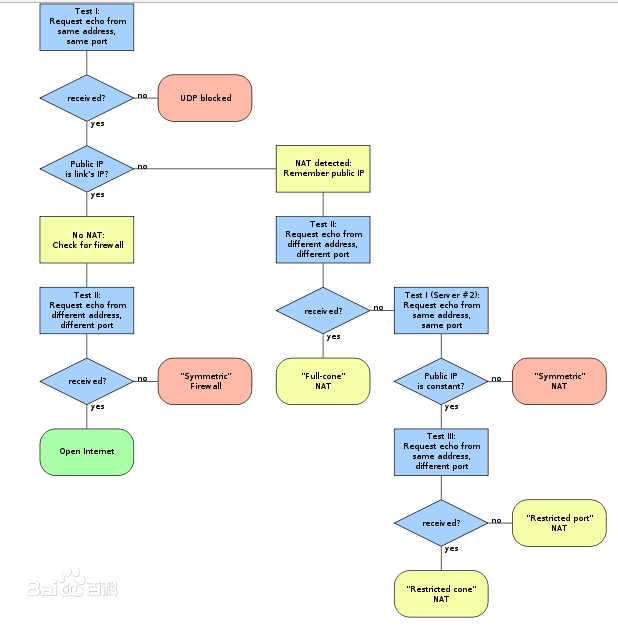

# 流媒体协议之webrtc

## NAT

在一对多模型中，按照端口转换的工作方式不同，又可以进行更进一步的划分。为描述方便，以下将IP和端口标记为(nAddr:nPort)，其中n代表主机或NAT网关的不同角色。

（1）全锥形NAT
　　其特点为：一旦内部主机端口对(iAddr:iPort)被NAT网关映射到(eAddr:ePort)，所有后续的(iAddr:iPort)报文都会被转换为(eAddr:ePort)；任何一个外部主机发送到(eAddr:ePort)的报文将会被转换后发到(iAddr:iPort)。

（2）限制锥形NAT
　　其特点为：一旦内部主机端口对(iAddr:iPort)被映射到(eAddr:ePort)，所有后续的(iAddr:iPort)报文都会被转换为(eAddr:ePort)；只有 (iAddr:iPort)向特定的外部主机hAddr发送过数据，主机hAddr从任意端口发送到(eAddr:ePort)的报文将会被转发到(iAddr:iPort)。

（3）端口限制锥形NAT
　　其特点为：一旦内部主机端口对(iAddr:iPort)被映射到(eAddr:ePort)，所有后续的(iAddr:iPort)报文都会被转换为(eAddr:ePort)；只有(iAddr:iPort)向特定的外部主机端口对(hAddr:hPort)发送过数据，由 (hAddr:hPort)发送到(eAddr:ePort)的报文将会被转发到(iAddr:iPort)。

（4）对称型NAT
　　其特点为：NAT网关会把内部主机“地址端口对”和外部主机“地址端口对”完全相同的报文看作一个连接，在网关上创建一个公网“地址端口对”映射进行转换，只有收到报文的外部主机从对应的端口对发送回应的报文，才能被转换。即使内部主机使用之前用过的地址端口对去连接不同外部主机(或端口)时，NAT网关也会建立新的映射关系。

## NAT穿透技术

针对NAT的弊端，为了解决IP端到端应用在NAT环境下遇到的问题，网络协议的设计者们创造了各种武器来进行应对。但遗憾的是，这里每一种方法都不完美，还需要在内部主机、应用程序或者NAT网关上增加额外的处理。

1、应用层网关(ALG)
　　应用层网关(ALG)是解决NAT对应用层协议无感知的一个最常用方法，已经被NAT设备厂商广泛采用，成为NAT设备的一个必需功能。

（1）作用
　　因为NAT不感知应用协议，所以有必要额外为每个应用协议定制协议分析功能，这样NAT网关就能理解并支持特定的协议。ALG与NAT形成互动关系，在一个NAT网关检测到新的连接请求时，需要判断是否为已知的应用类型，这通常是基于连接的传输层端口信息来识别的。在识别为已知应用时，再调用相应功能对报文的深层内容进行检查，当发现任何形式表达的IP地址和端口时，将会把这些信息同步转换，并且为这个新连接创建一个附加的转换表项。这样，当报文到达公网侧的目的主机时，应用层协议中携带的信息就是NAT网关提供的地址和端口。一旦公网侧主机开始发送数据或建立连接到此端口，NAT网关就可以根据关联表信息进行转换，再把数据转发到私网侧的主机。

　　很多应用层协议实现不限于一个初始连接(通常为信令或控制通道)加一个数据连接，可能是一个初始连接对应很多后续的新连接。比较特别的协议，在一次协商中会产生一组相关连接，比如RTP/RTCP协议规定，一个RTP通道建立后占用连续的两个端口，一个服务于数据，另一个服务于控制消息。此时，就需要ALG分配连续的端口为应用服务。ALG能成功解决大部分协议的NAT穿越需求，但是这个方法也有很大的限制。

（2）限制
　　因为应用协议的数量非常多而且在不断发展变化之中，添加到设备中的ALG功能都是为特定协议的特定规范版本而开发的，协议的创新和演进要求NAT设备制造商必须跟踪这些协议的最近标准，同时兼容旧标准。尽管有如Linux这种开放平台允许动态加载新的ALG特性，但是管理成本仍然很高，网络维护人员也不能随时了解用户都需要什么应用。因此为每个应用协议开发ALG代码并跟踪最新标准是不可行的，ALG只能解决用户最常用的需求。此外，出于安全性需要，有些应用类型报文从源端发出就已经加密，这种报文在网络中间无法进行分析，所以ALG无能为力。

2、探针技术STUN和TURN
　　探针技术，是通过在所有参与通信的实体上安装探测插件，以检测网络中是否存在NAT网关，并对不同NAT模型实施不同穿越方法的一种技术。

　　STUN服务器被部署在公网上，用于接收来自通信实体的探测请求，服务器会记录收到请求的报文地址和端口，并填写到回送的响应报文中。客户端根据接收到的响应消息中记录的地址和端口与本地选择的地址和端口进行比较，就能识别出是否存在NAT网关。如果存在NAT网关，客户端会使用之前的地址和端口向服务器的另外一个IP发起请求，重复前面的探测。然后再比较两次响应返回的结果判断出NAT工作的模式。由前述的一对多转换模型得知，除对称型NAT以外的模型，NAT网关对内部主机地址端口的映射都是相对固定的，所以比较容易实现NAT穿越。

　　而对称型NAT为每个连接提供一个映射，使得转换后的公网地址和端口对不可预测。此时TURN可以与STUN绑定提供穿越NAT的服务，即在公网服务器上提供一个“地址端口对”，所有此“地址端口对”接收到的数据会经由探测建立的连接转发到内网主机上。TURN分配的这个映射“地址端口对”会通过STUN响应发给内部主机，后者将此信息放入建立连接的信令中通知通信的对端。这种探针技术是一种通用方法，不用在NAT设备上为每种应用协议开发功能，相对于ALG方式有一定普遍性。但是TURN中继服务会成为通信瓶颈。而且在客户端中增加探针功能要求每个应用都要增加代码才能支持。

3、中间件技术
　　这也是一种通过开发通用方法解决NAT穿越问题的努力。

　　与前者不同之处是，NAT网关是这一解决方案的参与者。与ALG的不同在于，客户端会参与网关公网映射信息的维护，此时NAT网关只要理解客户端的请求并按照要求去分配转换表，不需要自己去分析客户端的应用层数据。

　　其中UPnP就是这样一种方法。UPnP中文全称为通用即插即用，是一个通用的网络终端与网关的通信协议，具备信息发布和管理控制的能力。其中，网关映射请求可以为客户动态添加映射表项。此时，NAT不再需要理解应用层携带的信息，只转换IP地址和端口信息。而客户端通过控制消息或信令发到公网侧的信息中，直接携带公网映射的IP地址和端口，接收端可以按照此信息建立数据连接。NAT网关在收到数据或连接请求时，按照UPnP建立的表项只转换地址和端口信息，不关心内容，再将数据转发到内网。这种方案需要网关、内部主机和应用程序都支持UPnP技术，且组网允许内部主机和NAT网关之间可以直接交换UPnP信令才能实施。

4、中继代理技术
　　准确说它不是NAT穿越技术，而是NAT旁路技术。

　　简单说，就是在NAT网关所在的位置旁边放置一个应用服务器，这个服务器在内部网络和外部公网分别有自己的网络连接。客户端特定的应用产生网络请求时，将定向发送到应用代理服务器。应用代理服务器根据代理协议解析客户端的请求，再从服务器的公网侧发起一个新的请求，把客户端请求的内容中继到外部网络上，返回的相应反方向中继。这项技术和ALG有很大的相似性，它要求为每个应用类型部署中继代理业务，中间服务器要理解这些请求。

5、特定协议自穿越技术
　　在所有方法中最复杂也最可靠的就是自己解决自己的问题。比如IKE和IPsec技术，在设计时就考虑了到如何穿越NAT的问题。因为这个协议是一个自加密的协议并且具有报文防修改的鉴别能力，其他通用方法爱莫能助。因为实际应用的NAT网关基本都是NAPT方式，所有通过传输层协议承载的报文可以顺利通过NAT。IKE和IPsec采用的方案就是用UDP在报文外面再加一层封装，而内部的报文就不再受到影响。IKE中还专门增加了NAT网关是否存在的检查能力以及绕开NAT网关检测IKE协议的方法。

### 例子：

```A机器在内网（192.168.0.4）
A机器在内网（192.168.0.4）

NAT服务器    （210.21.12.140）

B机器在公网（210.15.27.166）

C机器在公网（210.15.27.140）
```

如果 A 连接过机器B，假设是如下：A（192.168.0.4:5000）-> NAT（转换后210.21.12.140:8000）-> B（210.15.27.166:2000）。A和C从来没有通讯过。

不同类型的NAT，分析：

1.Full Cone NAT

C 将数据发送到 210.21.12.140:8000，NAT 会将数据包送到A（192.168.0.4:5000）。因为NAT上已经有192.168.0.4:5000到210.21.12.140:8000的映射。也就是说只要机器A与任何公网上机器通讯过，其它任何公网上机器都能发送数据给A，通过发送数据包给NAT上转换后的ip和端口之后，NAT会自动将数据包送到机器A。NAT 对发送给A的数据包来者不拒，不过滤。

2.Restricted Cone

C无法和A进行通信，因为A从来没有和C通信过，NAT会拒绝C试图与A连接的动作，但是B可以通过发送数据到210.21.12.140:8000和A的192.168.0.4:5000通信，这里机器B自己可以使用任何端口和A通信，譬如210.15.27.166:2001 -> 210.21.12.140:8000，NAT会将数据送到A的5000端口上。注意这里B使用的端口是2001 不是初始A连接B时，B接收A数据使用的端口2000。即只能是通信过的机器才能够进行通信，但是再通信时端口不需要固定。

3.Port Restricted Cone

C无法和A进行通信，因为A从来没有和C通信过，NAT会拒绝C试图与A连接的动作，而且机器B只能用它的210.15.27.166:2000与A的192.168.0.4:5000通信。即只有曾经收到内网地址A发送过数据包的公网机器，才能通过NAT映射后的地址向内网机制发送UDP包。

4.Symmetric NAT

如果A机器还想连接C机器，则NAT上产生一个新的映射，对应的转换可能为A（192.168.0.4:5000）-> NAT（转换后210.21.12.140:8001）-> C（210.15.27.140:2000）。

## STUN

 STUN主要有3个功能，分别是检测是否位于NAT后面，检测NAT的类型，获取经过NAT转换后的地址和端口。

在内网安装一个STUN Client，在公网上安装一个STUN Server。client 向server 发送request，server 发送response给client。

（1）检测是否位于NAT后面

       Server 在收到client 发送的UDP包以后，Server 将接收该包的地址和端口利用UDP再传回给client，client把Server发送过来的地址和端口信息与本机的ip地址和端口进行比较，如果不同，说明在NAT后面；如果相同就说明client位于NAT前面，client也是公网。

（2）检测NAT的类型

       这个主要发送响应的时候使用不同IP地址和端口或者改变端口等等。这个检测是对NAT一般情况下有效，但是对防火墙就无能为力了，因为防火墙可能不会打开UDP端口。


**STUN协议定义了三类测试过程来检测NAT类型，具体步骤见上图：**

- **Test1：**STUN Client通过端口{IP-C1:Port-C1}向STUN Server{IP-S1:Port-S1}发送一个Binding Request（没有设置任何属性）。STUN Server收到该请求后，通过端口{IP-S1:Port-S1}把它所看到的STUN Client的IP和端口{IP-M1,Port-M1}作为Binding Response的内容回送给STUN Client。
- **Test1#（server#2）：**STUN Client通过端口{IP-C1:Port-C1}向STUN Server{IP-S2:Port-S2}发送一个Binding Request（没有设置任何属性）。STUN Server收到该请求后，通过端口{IP-S2:Port-S2}把它所看到的STUN Client的IP和端口{IP-M1#2,Port-M1#2}作为Binding Response的内容回送给STUN Client。
- **Test2：**STUN Client通过端口{IP-C1:Port-C1}向STUN Server{IP-S1:Port-S1}发送一个Binding Request（设置了Change IP和Change Port属性）。STUN Server收到该请求后，通过端口{IP-S2:Port-S2}把它所看到的STUN Client的IP和端口{IP-M2,Port-M2}作为Binding Response的内容回送给STUN Client。
- **Test3：**STUN Client通过端口{IP-C1:Port-C1}向STUN Server{IP-S1:Port-S1}发送一个Binding Request（设置了Change Port属性）。STUN Server收到该请求后，通过端口{IP-S1:Port-S2}把它所看到的STUN Client的IP和端口{IP-M3,Port-M3}作为Binding Response的内容回送给STUN Client。

## TURN

https://www.cnblogs.com/cnhk19/p/14295201.html

## SDP

https://blog.csdn.net/anyRTC/article/details/132364882

## ICE

https://blog.csdn.net/chen_jianjian/article/details/128291645

## DTLS

在WebRtc中使用DTLS的地方包含两个地方，一个是DataChannel数据通道，一个是音视频媒体通道。在DataChannel数据通道，webrtc使用DTLS进行协商和加解密，在音视频通道webrtc使用SRTP进行数据加解密，DTLS用来做秘钥交换，交换完后就没有DTLS的事了。RTP/RTCP的数据加解密又SRTP保证。

## QOS

### FEC

### NACK
