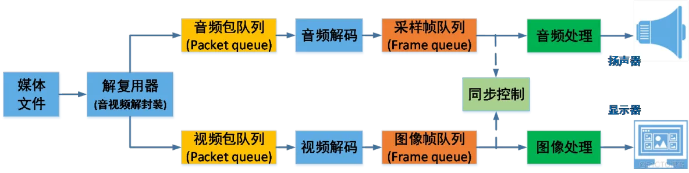

# ffplay源码研究一（原理及数据结构）

本文针对的是`ffmpeg-release-6.1`源码进行研究。

## 环境搭建

```
# 下载源码
git clone git@github.com:FFmpeg/FFmpeg.git
# 切换到release/6.1分支
git checkout release/6.1
./configure --disable-x86asm
make
```

## 目录结构

```
.
├── Changelog
├── compat
├── config_components.h
├── config.h
├── configure
├── CONTRIBUTING.md
├── COPYING.GPLv2
├── COPYING.GPLv3
├── COPYING.LGPLv2.1
├── COPYING.LGPLv3
├── CREDITS
├── doc
├── ffbuild
├── ffmpeg
├── ffmpeg_g
├── ffprobe
├── ffprobe_g
├── fftools
├── INSTALL.md
├── libavcodec
├── libavdevice
├── libavfilter
├── libavformat
├── libavutil
├── libpostproc
├── libswresample
├── libswscale
├── LICENSE.md
├── MAINTAINERS
├── Makefile
├── presets
├── README.md
├── RELEASE
├── tests
└── tools

```

## 播放器原理



1.对网络媒体数据流进行解封装得到一般的视频封装格式比如MP4等，如果是本地播放的媒体文件就不需要解协议。

2.对媒体文件进行解复用，得到未经过解码的视频、音频或者字幕流数据，在ffmpeg中得到的是AVPacket，在ffplay中会将数据放入Packet Queue之中

3.对字幕、音频和视频数据进行解码，分别得到字幕，PCM，YUV数据，在ffplay中会将数据放入Frame Queue之中。

4.不同数据体积不同解码速度不同，视频解码相对比较慢，如果解码完就立马播放就会出现音频和视频播放不一致的情况因此需要进行音画同步。分别有音频同步到视频，视频同步到音频，外部时钟三种。

5.将字幕，PCM，YUV数据进行播放。

## ffplay研究

### Packet Queue

如上图，Packet Queue主要是存储媒体文件解复用后的AVPacket。

```
// ffmpeg begin
struct AVFifo {
    uint8_t *buffer;

    size_t elem_size, nb_elems;
    size_t offset_r, offset_w;
    // distinguishes the ambiguous situation offset_r == offset_w
    int    is_empty;

    unsigned int flags;
    size_t       auto_grow_limit;
};
// ffmpeg end

typedef struct MyAVPacketList {
    AVPacket *pkt;
    int serial;
} MyAVPacketList;

typedef struct PacketQueue {
    AVFifo *pkt_list; // ffmpeg实现的FIFO缓冲区 实际存储的是MyAVPacketList节点
    int nb_packets; // 当前队列中avpcket的数量
    int size; // 队列中所有数据的总字节数
    int64_t duration; // 队列所有的时长之和
    int abort_request; // 是否终止对队列的操作，用于安全快速的退出
    int serial; // 序列号
    SDL_mutex *mutex; // 线程安全锁
    SDL_cond *cond; // 线程同步
} PacketQueue;
```

PacketQueue是一个线程安全FIFO队列，数据节点是MyAVPacketList，内部使用AVFifo实现数据的存取，abort_request控制队列的状态，muxte,cond进行同步和临界区保护。

**packet_queue_put**方法

```
static int packet_queue_put_private(PacketQueue *q, AVPacket *pkt)
{
    MyAVPacketList pkt1;
    int ret;

    if (q->abort_request)
       return -1;


    pkt1.pkt = pkt;
    pkt1.serial = q->serial;

    ret = av_fifo_write(q->pkt_list, &pkt1, 1); // 这里可见存储的实际是MyAVPacketList节点
    if (ret < 0)
        return ret;
    q->nb_packets++;
    q->size += pkt1.pkt->size + sizeof(pkt1);
    q->duration += pkt1.pkt->duration;
    /* XXX: should duplicate packet data in DV case */
    SDL_CondSignal(q->cond);
    return 0;
}

static int packet_queue_put(PacketQueue *q, AVPacket *pkt)
{
    AVPacket *pkt1;
    int ret;

    pkt1 = av_packet_alloc();
    if (!pkt1) {
        av_packet_unref(pkt);
        return -1;
    }
    av_packet_move_ref(pkt1, pkt);

    SDL_LockMutex(q->mutex);
    ret = packet_queue_put_private(q, pkt1);
    SDL_UnlockMutex(q->mutex);

    if (ret < 0)
        av_packet_free(&pkt1);

    return ret;
}
```

**packet_queue_get**方法

```
/* return < 0 if aborted, 0 if no packet and > 0 if packet.  */
static int packet_queue_get(PacketQueue *q, AVPacket *pkt, int block, int *serial)
{
    MyAVPacketList pkt1;
    int ret;

    SDL_LockMutex(q->mutex);

    for (;;) {
        if (q->abort_request) {
            ret = -1;
            break;
        }

        if (av_fifo_read(q->pkt_list, &pkt1, 1) >= 0) {
            q->nb_packets--;
            q->size -= pkt1.pkt->size + sizeof(pkt1);
            q->duration -= pkt1.pkt->duration;
            av_packet_move_ref(pkt, pkt1.pkt);
            if (serial)
                *serial = pkt1.serial;
            av_packet_free(&pkt1.pkt);
            ret = 1;
            break;
        } else if (!block) {
            ret = 0;
            break;
        } else {
            SDL_CondWait(q->cond, q->mutex);
        }
    }
    SDL_UnlockMutex(q->mutex);
    return ret;
}
```

由上方法可见，是一个十分典型的生产者消费者模型。在实际的ffplay实现中，read线程->packet_queue_put(AVPacket)->队列（notify）->demuxer(进行解码)线程，然后处理AVPacket数据。

**注：serial的更新时机，在放入同一个队列时队列会将自己的serial号赋值给对应的packet包，并且只有触发packet_queue_start和packet_queue_flush两个事件时才会更新serial。serial能够用来区分不同时刻解封装得到的packet是不是连续的包，如果播放时突然暂停，再resume的话serial更新，上一个packet和下一个packet就不是连续的。**

### Frame Queue

```
/* Common struct for handling all types of decoded data and allocated render buffers. */
typedef struct Frame {
    AVFrame *frame; // 解码的音频或者视频数据
    AVSubtitle sub; // 解码的字幕数据
    int serial;
    double pts;           /* presentation timestamp for the frame */
    double duration;      /* estimated duration of the frame */
    int64_t pos;          /* byte position of the frame in the input file */
    int width;
    int height;
    int format;
    AVRational sar; // 采样宽高比
    int uploaded; // 当前帧是否已经已经上屏，若果已经上屏则不会再刷新
    int flip_v; // 控制是否垂直翻转
} Frame;

typedef struct FrameQueue {
    Frame queue[FRAME_QUEUE_SIZE]; // 固定队列，环形缓冲区
    int rindex; // 读索引，队头
    int windex; // 写索引，队尾
    int size; // 当前队列中节点个数
    int max_size; // 最大允许存储的节点个数，方便区分是否full
    int keep_last; // 是否要保留最后一个读节点，1的话最后一个节点就不会被覆盖
    int rindex_shown; // 当前节点是否已经显示
    SDL_mutex *mutex; // 锁
    SDL_cond *cond; // 条件变量
    PacketQueue *pktq; // 关联的packet队列，实际会指向read的packet queue，frame_queue_init指定
} FrameQueue;
```

由上可见，FrameQueue明显是一个环形队列。而且为对rindex和windex进行cas或者加锁操作。Frame是同时能够表示音频、视频、字母的大杂烩，同时包含了一些状态信息来表示当前Frame的具体状态。

```
// 根据当前的读索引获取一个frame，rindex_shown的作用是如果当前节点已经被读取则跳过读取下一个；
static Frame *frame_queue_peek(FrameQueue *f)
{
    return &f->queue[(f->rindex + f->rindex_shown) % f->max_size];
}

// 相比于frame_queue_peek，读取下一个节点的数据；
static Frame *frame_queue_peek_next(FrameQueue *f)
{
    return &f->queue[(f->rindex + f->rindex_shown + 1) % f->max_size];
}

// 返回rindex指向的节点，无论是否被读取过；
static Frame *frame_queue_peek_last(FrameQueue *f)
{
    return &f->queue[f->rindex];
}

// 检查当前队列的wrindex指向的内存是否可写，如果可写则获取对应数据的指针，如果不可写的阻塞wait，否则返回对应节点的指针；
static Frame *frame_queue_peek_writable(FrameQueue *f)
{
    /* wait until we have space to put a new frame */
    SDL_LockMutex(f->mutex);
    while (f->size >= f->max_size &&
           !f->pktq->abort_request) {
        SDL_CondWait(f->cond, f->mutex);
    }
    SDL_UnlockMutex(f->mutex);

    if (f->pktq->abort_request)
        return NULL;

    return &f->queue[f->windex];
}

// 逻辑和frame_queue_peek_writable类似，检查队列是否为空，空则wait；否则返回可读的frame的指针；
static Frame *frame_queue_peek_readable(FrameQueue *f)
{
    /* wait until we have a readable a new frame */
    SDL_LockMutex(f->mutex);
    while (f->size - f->rindex_shown <= 0 &&
           !f->pktq->abort_request) {
        SDL_CondWait(f->cond, f->mutex);
    }
    SDL_UnlockMutex(f->mutex);

    if (f->pktq->abort_request)
        return NULL;

    return &f->queue[(f->rindex + f->rindex_shown) % f->max_size];
}
```

如上，上诉接口是进行对象池的直接操作，直接操作frame，其余是进行读写位置的更新。在上一节中，AVPacket已经存入了Packet Queue之中->packet_queue_get(Packet Queue)->avcodec_send_packet->avcodec_receive_frame(AVFrame)->Frame Queue

### 时钟

```
typedef struct Clock {
    double pts;           /* clock base */ // 当前帧(待播放)显示时间戳，播放后，当前帧变成上一帧
    double pts_drift;     /* clock base minus time at which we updated the clock */ //c->pts_drift = c->pts - time;
    double last_updated; // 当前时钟(如视频时钟)最后一次更新时间，也可称当前时钟时间
    double speed; // 时钟速度控制，用于控制播放速度
    int serial;           /* clock is based on a packet with this serial */ // 播放序列，所谓播放序列就是一段连续的播放动作，一个seek操作会启动一段新的播放序列
    int paused; // 暂停标志
    int *queue_serial;    /* pointer to the current packet queue serial, used for obsolete clock detection */
} Clock;
```

如下是Clock的一些接口以及实现

```
// 获取当前的时间，如果暂停状态则返回的是pts，播放状态则返回的是pts_drift + time - (time - last_updated) * (1 - speed)(time是系统时间)；c->pts_drift = c->pts - time;
static double get_clock(Clock *c)
{
    if (*c->queue_serial != c->serial)
        return NAN;
    if (c->paused) {
        return c->pts;
    } else {
        double time = av_gettime_relative() / 1000000.0;
        return c->pts_drift + time - (time - c->last_updated) * (1.0 - c->speed);
    }
}

// 设置参数
static void set_clock_at(Clock *c, double pts, int serial, double time)
{
    c->pts = pts;
    c->last_updated = time;
    c->pts_drift = c->pts - time;
    c->serial = serial;
}

// 设置参数
static void set_clock(Clock *c, double pts, int serial)
{
    double time = av_gettime_relative() / 1000000.0;
    set_clock_at(c, pts, serial, time);
}

// 设置speed
static void set_clock_speed(Clock *c, double speed)
{
    set_clock(c, get_clock(c), c->serial);
    c->speed = speed;
}

// 初始化时钟
static void init_clock(Clock *c, int *queue_serial)
{
    c->speed = 1.0;
    c->paused = 0;
    c->queue_serial = queue_serial;
    set_clock(c, NAN, -1);
}

// 将同步的主时钟同步到slave时钟上
static void sync_clock_to_slave(Clock *c, Clock *slave)
{
    double clock = get_clock(c);
    double slave_clock = get_clock(slave);
    if (!isnan(slave_clock) && (isnan(clock) || fabs(clock - slave_clock) > AV_NOSYNC_THRESHOLD))
        set_clock(c, slave_clock, slave->serial);
}

```

如上，上诉是学习ffplay需要知道的一些东西，后续将深入源码进行分析ffplay的实现。


