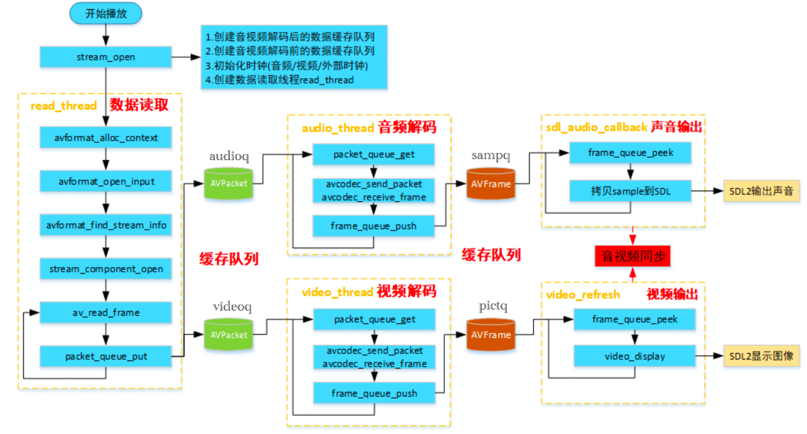

# ffplay源码研究二（初始化及stream_open)

## ffplay整体流程图



如上图，ffplay主要分为`read_thread`,`audio_thread`,`video_thread`,`video_refresh(event_loop部分)`,音频与视频之间同步。下面将对这些部分进行分析。

### 初始化

这里进行了代码省略，但主要有加载动态库路径，日志等级相关，用法，输入参数解析，SDL窗口，以及SDL相关，然后stream_open(重要)，以及event_loop处理用户输入

```
/* Called from the main */
int main(int argc, char **argv)
{
    ...
        window = SDL_CreateWindow(program_name, SDL_WINDOWPOS_UNDEFINED, SDL_WINDOWPOS_UNDEFINED, default_width, default_height, flags);
        
     ...

    is = stream_open(input_filename, file_iformat);
    if (!is) {
        av_log(NULL, AV_LOG_FATAL, "Failed to initialize VideoState!\n");
        do_exit(NULL);
    }

    event_loop(is);

    /* never returns */

    return 0;
}
```

如上，在初始化时进行了一下动态库路径，日志等级相关，用法，输入参数解析等，其中需要注意的是SDL_CreateWindow出来的window的实际渲染线程（event_loop）要和create的线程是同一个线程，否则会崩溃。

### stream_open部分

```
static VideoState *stream_open(const char *filename,
                               const AVInputFormat *iformat)
{
    VideoState *is;

    is = av_mallocz(sizeof(VideoState));
    if (!is)
        return NULL;
    // 状态值进行初始化 以及拷贝
    is->last_video_stream = is->video_stream = -1;
    is->last_audio_stream = is->audio_stream = -1;
    is->last_subtitle_stream = is->subtitle_stream = -1;
    is->filename = av_strdup(filename);
    if (!is->filename)
        goto fail;
    is->iformat = iformat;
    is->ytop    = 0;
    is->xleft   = 0;

    /* start video display */
    // frame queue进行初始化，以及指向packet queue，这里面会进行初始化线程同步的锁以及条件变量
    if (frame_queue_init(&is->pictq, &is->videoq, VIDEO_PICTURE_QUEUE_SIZE, 1) < 0)
        goto fail;
    if (frame_queue_init(&is->subpq, &is->subtitleq, SUBPICTURE_QUEUE_SIZE, 0) < 0)
        goto fail;
    if (frame_queue_init(&is->sampq, &is->audioq, SAMPLE_QUEUE_SIZE, 1) < 0)
        goto fail;

	// packet queue进行初始化 环形队列fifo初始化 这里面会进行初始化线程同步的锁以及条件变量
    if (packet_queue_init(&is->videoq) < 0 ||
        packet_queue_init(&is->audioq) < 0 ||
        packet_queue_init(&is->subtitleq) < 0)
        goto fail;

	// 这个条件变量是decoder_init会使用，即read和decode之间的同步 以及seek操作也会进行同步
    if (!(is->continue_read_thread = SDL_CreateCond())) {
        av_log(NULL, AV_LOG_FATAL, "SDL_CreateCond(): %s\n", SDL_GetError());
        goto fail;
    }

	// clock的初始化，以及clock的queue_serial会指向is->videoq.serial等
    init_clock(&is->vidclk, &is->videoq.serial);
    init_clock(&is->audclk, &is->audioq.serial);
    init_clock(&is->extclk, &is->extclk.serial);
    is->audio_clock_serial = -1; // 音频clock serial设置为-1
    // 音频相关
    if (startup_volume < 0)
        av_log(NULL, AV_LOG_WARNING, "-volume=%d < 0, setting to 0\n", startup_volume);
    if (startup_volume > 100)
        av_log(NULL, AV_LOG_WARNING, "-volume=%d > 100, setting to 100\n", startup_volume);
    startup_volume = av_clip(startup_volume, 0, 100);
    startup_volume = av_clip(SDL_MIX_MAXVOLUME * startup_volume / 100, 0, SDL_MIX_MAXVOLUME);
    is->audio_volume = startup_volume;
    is->muted = 0;
    is->av_sync_type = av_sync_type; // 记录同步类型
    // 创建读线程read_thread
    is->read_tid     = SDL_CreateThread(read_thread, "read_thread", is);
    if (!is->read_tid) {
        av_log(NULL, AV_LOG_FATAL, "SDL_CreateThread(): %s\n", SDL_GetError());
fail:
        stream_close(is);
        return NULL;
    }
    return is;
}
```

如上，stream_open的内容主要为变量初始化，frame queue初始化（锁，条件变量，以及指向packet queue），packet queue初始化（环形队列fifo初始化，锁，条件变量），以及continue_read_thread的初始化，continue_read_thread这个条件变量是decoder_init会使用，即read和decode之间的同步 以及seek操作也会进行同步。时钟初始化（其中时钟的queue_serial指向is->videoq.serial等）。然后创建读线程read_thread。


