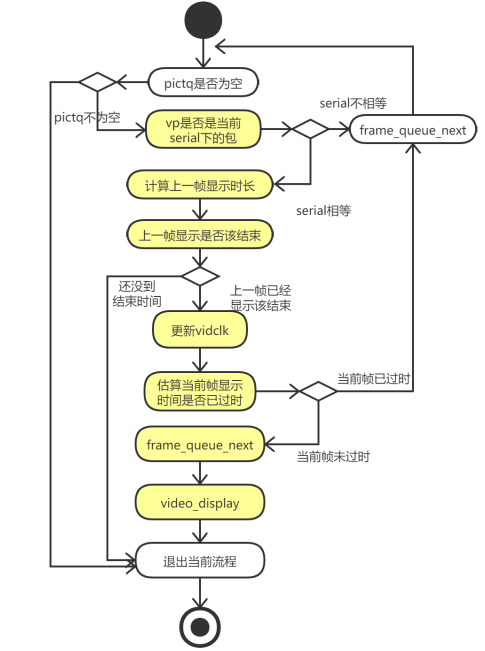

# ffplay源码研究五（音视频播放部分)

## ffplay整体流程图


便于理解，放一张图，本节主要分析的是音视频播放部分，即sdl_audio_callback和video_refresh部分。

### sdl_audio_callback(流程图右上角部分，在stream_component_open部分，对于音频有audio_open)

```
static int audio_open(void *opaque, AVChannelLayout *wanted_channel_layout, int wanted_sample_rate, struct AudioParams *audio_hw_params)
{
	... // 省略参数等设置
    wanted_spec.callback = sdl_audio_callback; // 这里设置回调，由SDL触发
    wanted_spec.userdata = opaque; // opaque即为VideoState
    while (!(audio_dev = SDL_OpenAudioDevice(NULL, 0, &wanted_spec, &spec, SDL_AUDIO_ALLOW_FREQUENCY_CHANGE | SDL_AUDIO_ALLOW_CHANNELS_CHANGE))) {
        ... // 省略错误逻辑判断
    }
    ... // 省略参数等设置
}
```

```
/* prepare a new audio buffer */
static void sdl_audio_callback(void *opaque, Uint8 *stream, int len)
{
    VideoState *is = opaque;
    int audio_size, len1;

    audio_callback_time = av_gettime_relative(); // 音视频同步用 时钟相关

    while (len > 0) {
        if (is->audio_buf_index >= is->audio_buf_size) { // 这个也是类似环形队列的
           audio_size = audio_decode_frame(is); // 这个里面有进行resample， resample为支持格式。否则可能有杂音，以及有时钟同步synchronize_audio，主要是从音频环形队列sampq里面获取Frame
           if (audio_size < 0) {
                /* if error, just output silence */
               is->audio_buf = NULL;
               is->audio_buf_size = SDL_AUDIO_MIN_BUFFER_SIZE / is->audio_tgt.frame_size * is->audio_tgt.frame_size;
           } else {
               if (is->show_mode != SHOW_MODE_VIDEO)
                   update_sample_display(is, (int16_t *)is->audio_buf, audio_size);
               is->audio_buf_size = audio_size;
           }
           is->audio_buf_index = 0;
        }
        len1 = is->audio_buf_size - is->audio_buf_index;
        if (len1 > len)
            len1 = len;
        if (!is->muted && is->audio_buf && is->audio_volume == SDL_MIX_MAXVOLUME)
            memcpy(stream, (uint8_t *)is->audio_buf + is->audio_buf_index, len1);
        else {
            memset(stream, 0, len1);
            if (!is->muted && is->audio_buf)
                SDL_MixAudioFormat(stream, (uint8_t *)is->audio_buf + is->audio_buf_index, AUDIO_S16SYS, len1, is->audio_volume); // 拷贝进sdl里面
        }
        len -= len1;
        stream += len1;
        is->audio_buf_index += len1;
    }
    is->audio_write_buf_size = is->audio_buf_size - is->audio_buf_index;
    /* Let's assume the audio driver that is used by SDL has two periods. */
    
    // 时钟同步
    if (!isnan(is->audio_clock)) {
        set_clock_at(&is->audclk, is->audio_clock - (double)(2 * is->audio_hw_buf_size + is->audio_write_buf_size) / is->audio_tgt.bytes_per_sec, is->audio_clock_serial, audio_callback_time / 1000000.0);
        sync_clock_to_slave(&is->extclk, &is->audclk);
    }
}
```

对于audio_open是设置一些参数，比如支持一些什么格式的音视频，以及设置回调函数sdl_audio_callback。供sdl进行回调。sdl_audio_callback会记录回调时间，进行音视频时钟的同步，主要是从环形队列sampq里面获取AVFrame，然后转成支持的格式Resample，以及音频的时钟同步丢帧之类的。然后拷贝进sdl_audio_callback的stream参数里面，供设备播放。

## video_refresh

```
static void event_loop(VideoState *cur_stream)
{
    SDL_Event event;
    double incr, pos, frac;

    for (;;) {
        double x;
        refresh_loop_wait_event(cur_stream, &event);
        ... // 按键处理
    }
}
```

video_refresh在event_loop->refresh_loop_wait_event里面被调用，其中event_loop主要是进行refresh_loop_wait_event，以及按键事件响应。

```
static void refresh_loop_wait_event(VideoState *is, SDL_Event *event) {
    double remaining_time = 0.0; // 剩余时间
    SDL_PumpEvents();
    while (!SDL_PeepEvents(event, 1, SDL_GETEVENT, SDL_FIRSTEVENT, SDL_LASTEVENT)) {
        if (!cursor_hidden && av_gettime_relative() - cursor_last_shown > CURSOR_HIDE_DELAY) { // 按键事件，以及是否隐藏鼠标
            SDL_ShowCursor(0);
            cursor_hidden = 1;
        }
        if (remaining_time > 0.0)
            av_usleep((int64_t)(remaining_time * 1000000.0)); // 休眠
        remaining_time = REFRESH_RATE; // 赋初值为REFRESH_RATE
        if (is->show_mode != SHOW_MODE_NONE && (!is->paused || is->force_refresh))
            video_refresh(is, &remaining_time); // 进行渲染 以及音视频同步
        SDL_PumpEvents();
    }
}
```

如上，主要是获取按键事件。以及进行渲染video_refresh，video_refresh会计算remaining_time，通过av_usleep渲染该时间。

如下为video_refresh的流程图



```
/* called to display each frame */
static void video_refresh(void *opaque, double *remaining_time)
{
    VideoState *is = opaque;
    double time;

    Frame *sp, *sp2;

	// 检查外部时钟同步
    if (!is->paused && get_master_sync_type(is) == AV_SYNC_EXTERNAL_CLOCK && is->realtime)
        check_external_clock_speed(is);

	// audio显示
    if (!display_disable && is->show_mode != SHOW_MODE_VIDEO && is->audio_st) {
        time = av_gettime_relative() / 1000000.0;
        if (is->force_refresh || is->last_vis_time + rdftspeed < time) {
            video_display(is);
            is->last_vis_time = time;
        }
        *remaining_time = FFMIN(*remaining_time, is->last_vis_time + rdftspeed - time);
    }

    if (is->video_st) {
retry:
        if (frame_queue_nb_remaining(&is->pictq) == 0) { // 待渲染为空
            // nothing to do, no picture to display in the queue
        } else {
            double last_duration, duration, delay;
            Frame *vp, *lastvp;

            /* dequeue the picture */
            lastvp = frame_queue_peek_last(&is->pictq); // 获取当前显示帧
            vp = frame_queue_peek(&is->pictq); // 获取待显示帧

 			// 如果待显示帧序列和当前渲染序列不一致，则进行丢帧，seek之类操作
            if (vp->serial != is->videoq.serial) {
                frame_queue_next(&is->pictq);
                goto retry;
            }

			// 如果当前显示帧和待显示帧序列不一致，seek之类操作，新的播放序列重置当前时间
            if (lastvp->serial != vp->serial)
                is->frame_timer = av_gettime_relative() / 1000000.0;

            if (is->paused) // 暂停则继续渲染当前帧
                goto display;

            /* compute nominal last_duration */
            // 计算相邻两帧间隔时长 pts相减，以及判断
            last_duration = vp_duration(is, lastvp, vp); 
            //计算上一帧lastvp还需要播放时间 判断同步类型，如果是video master则直接返回last_duration
            // 否则进行时钟同步 同步见下一章
            delay = compute_target_delay(last_duration, is);
			
			// 获取当前时间，如果当前time在渲染区间内，则进行remain time更新，供av_sleep
            time= av_gettime_relative()/1000000.0;
            if (time < is->frame_timer + delay) {
                *remaining_time = FFMIN(is->frame_timer + delay - time, *remaining_time);
                goto display;
            }

			// 更新frame_timer
            is->frame_timer += delay;
            if (delay > 0 && time - is->frame_timer > AV_SYNC_THRESHOLD_MAX)
                is->frame_timer = time;

            SDL_LockMutex(is->pictq.mutex);
            if (!isnan(vp->pts))
                update_video_pts(is, vp->pts, vp->serial); // 更新pts
            SDL_UnlockMutex(is->pictq.mutex);

			// 丢帧处理
            if (frame_queue_nb_remaining(&is->pictq) > 1) {
                Frame *nextvp = frame_queue_peek_next(&is->pictq);
                duration = vp_duration(is, vp, nextvp);
                if(!is->step && (framedrop>0 || (framedrop && get_master_sync_type(is) != AV_SYNC_VIDEO_MASTER)) && time > is->frame_timer + duration){
                    is->frame_drops_late++;
                    frame_queue_next(&is->pictq); // 丢帧处理
                    goto retry;
                }
            }

            if (is->subtitle_st) { // 字幕处理 这里不分析
                while (frame_queue_nb_remaining(&is->subpq) > 0) {
                    sp = frame_queue_peek(&is->subpq);

                    if (frame_queue_nb_remaining(&is->subpq) > 1)
                        sp2 = frame_queue_peek_next(&is->subpq);
                    else
                        sp2 = NULL;

                    if (sp->serial != is->subtitleq.serial
                            || (is->vidclk.pts > (sp->pts + ((float) sp->sub.end_display_time / 1000)))
                            || (sp2 && is->vidclk.pts > (sp2->pts + ((float) sp2->sub.start_display_time / 1000))))
                    {
                        if (sp->uploaded) {
                            int i;
                            for (i = 0; i < sp->sub.num_rects; i++) {
                                AVSubtitleRect *sub_rect = sp->sub.rects[i];
                                uint8_t *pixels;
                                int pitch, j;

                                if (!SDL_LockTexture(is->sub_texture, (SDL_Rect *)sub_rect, (void **)&pixels, &pitch)) {
                                    for (j = 0; j < sub_rect->h; j++, pixels += pitch)
                                        memset(pixels, 0, sub_rect->w << 2);
                                    SDL_UnlockTexture(is->sub_texture);
                                }
                            }
                        }
                        frame_queue_next(&is->subpq);
                    } else {
                        break;
                    }
                }
            }

            frame_queue_next(&is->pictq); // 更新下一帧
            is->force_refresh = 1; // 更新

            if (is->step && !is->paused)
                stream_toggle_pause(is);
        }
display:
        /* display picture */
        if (!display_disable && is->force_refresh && is->show_mode == SHOW_MODE_VIDEO && is->pictq.rindex_shown)
            video_display(is); // 显示图像
    }
    is->force_refresh = 0;
    if (show_status) { // 打印状态
        AVBPrint buf;
        static int64_t last_time;
        int64_t cur_time;
        int aqsize, vqsize, sqsize;
        double av_diff;

        cur_time = av_gettime_relative();
        if (!last_time || (cur_time - last_time) >= 30000) {
            aqsize = 0;
            vqsize = 0;
            sqsize = 0;
            if (is->audio_st)
                aqsize = is->audioq.size;
            if (is->video_st)
                vqsize = is->videoq.size;
            if (is->subtitle_st)
                sqsize = is->subtitleq.size;
            av_diff = 0;
            if (is->audio_st && is->video_st)
                av_diff = get_clock(&is->audclk) - get_clock(&is->vidclk);
            else if (is->video_st)
                av_diff = get_master_clock(is) - get_clock(&is->vidclk);
            else if (is->audio_st)
                av_diff = get_master_clock(is) - get_clock(&is->audclk);

            av_bprint_init(&buf, 0, AV_BPRINT_SIZE_AUTOMATIC);
            av_bprintf(&buf,
                      "%7.2f %s:%7.3f fd=%4d aq=%5dKB vq=%5dKB sq=%5dB f=%"PRId64"/%"PRId64"   /r",
                      get_master_clock(is),
                      (is->audio_st && is->video_st) ? "A-V" : (is->video_st ? "M-V" : (is->audio_st ? "M-A" : "   ")),
                      av_diff,
                      is->frame_drops_early + is->frame_drops_late,
                      aqsize / 1024,
                      vqsize / 1024,
                      sqsize,
                      is->video_st ? is->viddec.avctx->pts_correction_num_faulty_dts : 0,
                      is->video_st ? is->viddec.avctx->pts_correction_num_faulty_pts : 0);

            if (show_status == 1 && AV_LOG_INFO > av_log_get_level())
                fprintf(stderr, "%s", buf.str);
            else
                av_log(NULL, AV_LOG_INFO, "%s", buf.str);

            fflush(stderr);
            av_bprint_finalize(&buf, NULL);

            last_time = cur_time;
        }
    }
}
```

如上，主要是先判断是否是外部时钟，然后进行时钟设置。判断pictq是否为空，不为空则计算上一帧时长，以及是否渲染结束，如果是更新结束进行时钟更新，然后进行帧渲染。

